# OSI: Open Solana Intelligence

**An open, wallet-signed, community-reviewed intelligence desk for the Solana ecosystem.**

OSI turns public on-chain and open-source evidence into attributable, challengeable, verifiable incident records. Every meaningful action is signed by a real wallet, reviewed by independent analysts, anchored to Solana mainnet, and permanently auditable by anyone.

**Live:** https://open-solana-intel.vercel.app

> Informational intelligence only. OSI is not legal or financial advice, holds no custody, guarantees no recovery, and never declares guilt. Attribution remains challengeable at all times.

---

## Why OSI exists

The people who need on-chain forensics the most can reach it the least. Victims of drains, rugs, and scams rarely have the budget for private analysts. Skilled community analysts do great work in private chats, where it builds no public track record. Exchanges and law enforcement receive scattered screenshots instead of structured, verifiable evidence.

OSI's answer is **process integrity**: a public system that proves who submitted what, which wallet signed which exact version, who reviewed it, what was decided, at what voting weight, whether it was challenged, and how it was sealed. OSI does not promise truth. It proves process, in public, on chain.

## What is built and live

| Capability | Status |
|---|---|
| Case intake (private by default, wallet-signed, Memo-anchored) | Live |
| Case initial review and public opening | Live |
| Immutable Case Report versions with evidence manifests | Live |
| Weighted analyst review, quorum publication | Live |
| Resolution, 7-day challenge window, sealing | Live |
| Native SOL reward and voluntary support (non-custodial, RPC-verified) | Live |
| The Wire: standalone intelligence publication lane | Live |
| Analyst onboarding with on-chain SAS credentials and public verifier | Live |
| Shared private read session (one signature per 5 minutes) | Live |
| Bootstrap governance (transparent, self-decaying cold-start mode) | Live |
| AI Pack: evidence-bound, three-layer AI briefs with analyst approval | Built, activation pending |
| SAS credential enforcement in governance weight | In active development |
| Memo-anchored public record links | In active development |

The platform is deployed and open for its first Cases. The network is at its honest cold start: no invented activity, no vanity metrics, no fake wallets. Everything you see is either a real record or a truthful empty state.

## Where Solana is load-bearing

OSI is deliberate about what belongs on chain. Fast, private review and discussion run off chain where they should. Solana secures the parts where trust must become independently verifiable, and removing it would break the guarantee the product exists to make:

- **The public governance record is Memo-anchored on mainnet.** Case submission, public opening, report publication, and sealing are confirmed Solana Memo transactions using a canonical grammar. The record is not OSI saying a thing happened; it is a transaction anyone can pull from the chain, and not even the maintainer can silently rewrite it.
- **Payments are non-custodial and RPC-verified.** Rewards and support are direct wallet-to-wallet SOL transfers through the System Program. A payment is labeled confirmed only after finalized mainnet verification of exact payer, recipients, lamports, and memo. OSI never holds funds.
- **Analyst authority is a portable on-chain credential.** Every active analyst holds a real Solana Attestation Service credential that any third party can verify directly against the chain, with no dependence on OSI's database. An analyst's standing survives even if OSI does not.

We are actively deepening this: making the SAS credential a hard gate on governance weight, and attaching a resolvable public reference to every governance Memo so a Solana transaction alone leads anyone straight to the verifiable record. See **In active development** below.

## How a Case works

```mermaid
flowchart LR
    A[Wallet submits Case\nprivate by default] -->|CASE_SUBMITTED Memo| B[Initial review]
    B -->|analyst or maintainer approval\nCASE_OPENED Memo| C[Public investigation]
    C --> D[Immutable Report versions\nsubmitted by any wallet]
    D -->|independent analyst quorum\nREPORT_PUBLISHED Memo| E[Published Reports]
    E -->|weighted selection| F[Winning Report chosen]
    F --> G[7-day challenge window]
    G -->|no blocking challenge\nRECORD_SEALED Memo| H[Sealed public record]
    H --> I[Reward paid directly\nwallet to wallet, RPC-verified]
```



Every arrow above is backed by a wallet signature or a confirmed Solana Memo transaction. Nothing advances silently.

## Two lanes, one product

**Field Office** is investigation-first. A Case starts with a question or an incident, usually with an owner, optionally with a pledged reward, and ends in a sealed, challengeable public record.

**The Wire** is finding-first. Any connected wallet can publish standalone intelligence: wallet clusters, fund-flow analyses, treasury research, verification of public claims. No victim or open Case is required. Wire Reports go through the same immutable versioning and independent review before publication, and a published finding can be promoted into a full Case when it deserves deeper investigation.

## The proof model

OSI never blurs the line between different kinds of evidence. Every receipt in the Proof Log carries exactly one honest label:

1. **Memo-anchored on Solana**: a confirmed mainnet transaction using the canonical OSI2 memo grammar. Used for public governance outcomes such as CASE_SUBMITTED, CASE_OPENED, REPORT_PUBLISHED, WIRE_REPORT_PUBLISHED, RECORD_SEALED.
2. **Wallet-signed and server-verified**: an Ed25519 signMessage receipt verified server-side. Used for individual decisions such as reviews. Never presented as on-chain.
3. **System event**: a server-generated state transition.
4. **Legacy import, not server-verified**: historical V1 data, always visibly distinct.

Every signed write is protected by a five-stage replay defense: a cryptographically random single-use server nonce, short expiry, exact purpose and target binding, canonical payload hash, and atomic consumption with idempotent retry. A stateless nonce check is forbidden by design.

## Analyst network and on-chain credentials

Analysts earn authority, they are not appointed. Two onboarding paths exist: a direct wallet-signed application reviewed in public process, and automatic candidacy earned when a wallet's report wins a resolved Case. Voting power is bounded between 0.50 and 3.00 and grows only through a documented tier ladder based on accepted contributions and review quality. No payment, donation, or support ever influences weight, ranking, or governance.

Every active analyst holds a real, revocable **Solana Attestation Service (SAS)** credential on mainnet, issued automatically at activation and revoked on demotion. Anyone, including third-party applications and grant reviewers with no wallet of their own, can verify a wallet's analyst status directly against Solana without trusting OSI's database, through the public verifier on the About page or against the chain directly:

- SAS Program: [`22zoJMtdu4tQc2PzL74ZUT7FrwgB1Udec8DdW4yw4BdG`](https://solscan.io/account/22zoJMtdu4tQc2PzL74ZUT7FrwgB1Udec8DdW4yw4BdG)
- OSI Credential: [`D2tsrEHEXYPL82chv5PuwsQtALv1i5hXrWZorqyefJgX`](https://solscan.io/account/D2tsrEHEXYPL82chv5PuwsQtALv1i5hXrWZorqyefJgX)
- OSI_VERIFIED_ANALYST Schema: [`897TYTVN9aQfLWj2BJyhByQawsSuydLZcTpanZWCtxKz`](https://solscan.io/account/897TYTVN9aQfLWj2BJyhByQawsSuydLZcTpanZWCtxKz)

The schema stores only integer tier and status codes. No names, no personal data, no case content ever goes on chain.

## Governance that cannot be faked

Critical outcomes require both a minimum count of independent analysts and a minimum total voting weight. A single analyst can never decide a critical outcome alone, even at maximum weight. Authors can never review their own work; this is enforced at the database boundary, not just in the interface.

During the network's cold start, a transparent **bootstrap mode** lets the double-authenticated maintainer advance publications, winner selections, and seals. Every such decision is permanently recorded on a distinct `maintainer_bootstrap` channel and is never presented as analyst consensus. The mode dismantles itself in code as the real network grows: at 20 eligible analysts the maintainer needs an independent analyst alongside every decision, at 30 two analysts, and at 50 the mode retires entirely and the original thresholds take over. Challenge verdicts and AI Pack approvals are never available to bootstrap under any circumstances.

## AI Pack

An AI Pack is a versioned, evidence-bound intelligence brief generated from server-approved Case evidence. It is an artifact, never a verdict: OSI displays a transparent Evidence Confidence Profile (public verifiability, on-chain reproducibility, evidence coverage, source consistency, analyst attestation) and never a single accuracy, truth, or guilt score. Each version carries three separately hashed content layers (public brief, owner-safe, analyst-restricted), goes stale per layer when its underlying evidence changes, and becomes visible publicly only after independent analyst approval that the pack's creator can never take part in. Generation runs entirely server-side under strict rate, quota, and cost limits; no AI provider key ever reaches a browser. The full mechanism is built and tested; public activation is deliberately gated behind a real analyst quorum.

## Payments without custody

Rewards and voluntary support are direct wallet-to-wallet native SOL transfers through the Solana System Program. OSI never holds funds, takes no commission, and never signs on a user's behalf. A payment is labeled confirmed only after trusted server code verifies the finalized transaction on mainnet RPC: exact payer, exact recipients, exact lamports, canonical memo, and replay binding. A pledged reward can only be paid after sealing, only to the exact winning report author, and never above the frozen pledge.

## Architecture

```
Browser (static HTML/CSS/JS, no build step, no framework)
   |  Phantom wallet: connect, signMessage, transactions
   v
Supabase Edge Functions (Deno)          Solana mainnet
   osi-v2-case-read / case-write   <->  Memo program (OSI2 grammar)
   osi-v2-report-read / report-write    System Program transfers
   osi-v2-governance-write              SAS attestations
   osi-v2-wire, osi-v2-payment
   osi-v2-analyst, osi-v2-proof, AI Pack
   |  service-only RPCs, Stage-5 proofs
   v
PostgreSQL (Supabase)
   32 domain tables, FORCE row level security, default deny
   append-only reviews, immutable versions, event receipts
```

Key properties:

- **Default deny everywhere.** Browsers hold no privileged database access. Every client-reachable table has forced row level security with zero anonymous policies; all mutations flow through service-only RPCs behind wallet proofs.
- **Immutability by construction.** Published versions, reviews, and receipts are append-only. Corrections create new versions; history is never rewritten. This is enforced by database triggers, not convention: even the maintainer cannot delete or silently alter a sealed record or a Case's provenance.
- **Fail-closed feature flags.** Every capability ships behind a dedicated flag that treats a missing or malformed value as off.
- **Honest UI.** Every visible control maps to a real authorized endpoint. Disabled features state their exact unmet prerequisite. Empty states never invent activity.

See [docs/ARCHITECTURE.md](docs/ARCHITECTURE.md) for the full map and [docs/USER_GUIDE.md](docs/USER_GUIDE.md) for the complete role-by-role handbook.

## In active development

These are the current build priorities. Each deepens the role Solana already plays rather than adding surface:

- **SAS credential enforcement.** The credential is live on chain today and shown wherever an analyst appears. The enforcement path, where a review counts toward governance weight only when the caster's SAS credential verifies live on chain at the moment of the vote, is being activated so the on-chain credential becomes a hard gate on authority rather than a badge. The verification ledger already exists in the schema; activation is fail-closed and staged with the growing analyst network.
- **Memo-anchored public record links.** Every public governance Memo is being extended to carry a neutral, resolvable public reference, so a single Solana transaction leads anyone directly from the chain to the exact verifiable record without trusting OSI's database. The reference is a non-narrative identifier only; no subject name or case content ever enters a Memo.
- **Durable public record.** Sealed Cases mirrored to permanent content-addressed storage (Arweave), paid in SOL, with the content hash anchored by Memo, so the public record outlives any single database.

## Repository structure

```
index.html              Main application shell
assets/css/             Modular stylesheets (design token system)
assets/js/              Classic JS modules (wallet, workspaces, integrations)
supabase/migrations/    Ordered, additive SQL migrations
supabase/functions/     Deno Edge Functions and shared cores
supabase/tests/         pgTAP authorization and lifecycle suites
tests/                  Dependency-free Node suites, browser E2E, concurrency
docs/                   Product constitution, domain model, state machines,
                        role matrix, decision register, guides
.github/workflows/      CI validation and typed, main-only production rollouts
tools/                  One-time maintainer utilities (SAS setup)
```

## Testing and delivery discipline

Every change passes a full battery before reaching production: dependency-free Node suites, Deno type checks, a clean PostgreSQL migration from zero, database lint at error level, pgTAP authorization tests for every role, two-connection replay and race tests, stored-XSS regression coverage, and browser contracts at desktop and 390px mobile. Production rollouts run only through typed-confirmation, main-only workflows that dry-run the exact expected migrations, snapshot every feature flag and row count before and after, and fail closed by disabling only the affected flag.

## Roadmap

Beyond the active work above, in no committed order:

- Reputation progression: automatic tier advancement from accepted contributions and review accuracy, with public analyst CV pages.
- Notifications and My OSI: actionable indicators for reward due, revision requested, challenge opened, and seal ready.
- Public metrics: independently verifiable network statistics with no vanity numbers.
- Community handover: progressive retirement of every remaining maintainer privilege as the analyst network grows.

## Contributing

Contributions are welcome. Start with [CONTRIBUTING.md](CONTRIBUTING.md), the engineering contract in [AGENTS.md](AGENTS.md), and the decision register in [docs/OSI_V2_OPEN_DECISIONS.md](docs/OSI_V2_OPEN_DECISIONS.md). Security reports go through [SECURITY.md](SECURITY.md), never public issues.

## License

[MIT](LICENSE)

---

**Built on Solana. Verified by wallets. Reviewed by people.**
