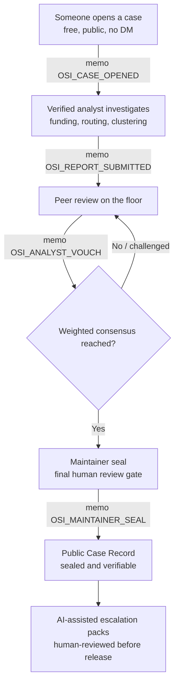

# OSI · Open Solana Intelligence

**An open, community-run intelligence desk for on-chain Solana incidents.**
When SOL is drained, rugged, or scammed and the victim cannot trace it alone, OSI turns scattered on-chain evidence into reviewed, verifiable **case records** and ready-to-send **escalation packs**, all in public.

> Information only. No financial or legal advice, and no promise to recover funds.

**Built on:** Solana · Supabase · Phantom · Vercel
**Live:** https://open-solana-intel.vercel.app/

---

## Table of contents

- [Why OSI exists](#why-osi-exists)
- [What OSI is](#what-osi-is)
- [How it works: the case lifecycle](#how-it-works-the-case-lifecycle)
- [Verifiable on-chain (Solana Memo)](#verifiable-on-chain-solana-memo)
- [Public Case Records](#public-case-records)
- [AI-assisted escalation packs](#ai-assisted-escalation-packs)
- [Analyst reputation and review](#analyst-reputation-and-review)
- [What makes OSI different](#what-makes-osi-different)
- [Architecture and tech stack](#architecture-and-tech-stack)
- [Project structure](#project-structure)
- [Running and deploying](#running-and-deploying)
- [Roadmap](#roadmap)
- [Safety, scope, and disclaimers](#safety-scope-and-disclaimers)
- [Contributing](#contributing)

---

## Why OSI exists

The people who need on-chain forensics the most are usually the ones who can reach it the least.

- **Victims are often broke after the hack.** They lost the funds, so paying for a private analyst or opening a paid bounty is rarely an option.
- **Trust is concentrated.** Users only trust a handful of well-known analysts, and getting those analysts to look at a fresh case, for free, is hard.
- **Nobody knows what to tell an exchange or the police.** Victims rarely know how to package evidence for a compliance desk, and local law enforcement often struggles to read on-chain activity.
- **New analysts have nowhere to prove themselves.** Most help happens in private DMs, so good work never builds a public track record, and the next generation of analysts has no arena to grow in.
- **The "how" is never shared.** The community sees a result, but newcomers cannot learn how the trail was actually followed.

Existing bounty platforms are useful, but verdicts are decided centrally. That is fine until the company pivots, runs out of money, or lays off the team. **OSI is built so the public record outlives any single operator.** Cases are public, analysts prove themselves in the open, and findings publish through peer consensus, so even if the founder steps away, the system keeps running.

OSI is a public good. It is **not profit-driven.**

---

## What OSI is

OSI is a **case-first, public on-chain forensic platform** for Solana.

- **Anyone can open a case for free.** No private contact, no fee, no wallet drained twice by middlemen.
- **Verified analysts investigate** the funding, routing, and clustering directly on-chain.
- **Peers review the work.** A finding does not publish on one voice; it clears a weighted consensus of independent analysts, with a maintainer seal as the final human check while the network grows.
- **The result becomes a permanent, public, on-chain-verifiable case record**, with the methodology attached so the technique spreads, not just the answer.
- **Every meaningful action is signed as a Solana Memo**, so the whole trail can be checked on any block explorer without taking OSI's word for it.

The reward for analysts is **reputation, not resale.** What an analyst earns here is a signed, public track record.

---

## How it works: the case lifecycle



A case moves through honest, visible states: **Under review → Reviewed → Sealed.** A case is never shown as sealed until it actually is.

---

## Verifiable on-chain (Solana Memo)

OSI does not ask you to trust a database. Each meaningful action writes a signed entry to the **SPL Memo program** on Solana mainnet, timestamped and permanent. Anyone can open the transaction in a block explorer (for example Solscan) and read the memo for themselves.

| Memo | When it is written |
| --- | --- |
| `OSI_CASE_OPENED` | A public case is created |
| `OSI_REPORT_SUBMITTED` | An analyst report is hashed and anchored on-chain |
| `OSI_ANALYST_VOUCH` | A verified analyst signs a vouch to publish |
| `OSI_CHALLENGE_FILED` | An analyst challenges a finding with evidence |
| `OSI_CASE_BACKED` | A signed signal of demand for a case |
| `OSI_WIRE_DISPATCH_SUBMITTED` | A field-office dispatch is filed |
| `OSI_MAINTAINER_SEAL` | The final maintainer seal on a reviewed case |

Because the report itself is hashed and the hash is written on-chain, a published finding can be proven to predate any later edit.

---

## Public Case Records

The **Public Case Records** archive is the front door to OSI's output. It is a premium public intelligence archive, not a social feed.

Each record is a compact, scannable dossier:

- OSI case id and title
- Honest status: **Reviewed** or **Sealed**
- On-chain evidence indicators and any available escalation packs
- **Verify on Solana** (links straight to the signing transaction)
- **Open Case Record**, which opens a focused side drawer for that single case so the page stays clean as the archive grows

The drawer shows the full picture for one case: verification (Solana Memo and transaction reference), summary, evidence, analyst-review status, any **reviewed** escalation packs to download, and the standing disclaimer. Draft (unreviewed) AI packs are never shown publicly.

---

## AI-assisted escalation packs

Once a case clears review, OSI can turn the public on-chain evidence into a structured brief for whoever can act on it:

- **Victim Brief**: a plain-language summary for the affected user
- **Exchange Pack**: structured evidence for an exchange compliance desk
- **Law Enforcement Brief**: a formatted dossier for cyber and LE units

Hard rules baked into the feature:

- AI output is an **artifact, not a chat message.**
- Every pack is **AI-assisted and human-reviewed.** It carries a clear "review required" state and only becomes public after a maintainer reviews it.
- **No legal advice, no recovery promise, no accusation language**, and no invented wallets, transactions, people, or exchanges.
- During the pilot, **generation is maintainer-only.** The model never receives or returns anything beyond the public case evidence, and the AI key lives **only on the server**, never in the browser.

---

## Analyst reputation and review

OSI is designed to grow a real analyst base in the open.

- Analysts apply and identify themselves by wallet signature.
- A pending finding is reviewed on the consensus floor: peers **vouch to publish** or **flag** with evidence.
- Today a maintainer holds the final seal while the roster grows, so nothing slips through unchecked.
- As the network matures, that approval power moves to the analysts themselves, weighted by reputation.

A reputation-weighted voting model (where the person opening a case sets how much analyst consensus is required to publish, and analyst weight is capped so no single voice can dominate) and a public **Proof Log** of every signed action are in active design. See the [Roadmap](#roadmap).

---

## What makes OSI different

- **Public by default.** A closed marketplace stops at the buyer; OSI stops at the public. Everyone gets the intelligence.
- **Survives its operator.** Consensus and on-chain proof mean the record does not depend on one company staying solvent or one admin staying employed.
- **No paid verdicts.** Support is peer-to-peer and optional; OSI verifies the work, never the payment, and never guarantees it.
- **Teaches, not just tells.** The methodology travels with every record, so the technique spreads.
- **Honest by construction.** Confidence is graded, status is never overstated, and a wrong call is visible and fixable in the open instead of buried in a private dataset.

---

## Architecture and tech stack

OSI is intentionally lightweight and dependency-light, so it is easy to audit and easy to host.

| Layer | Choice |
| --- | --- |
| Frontend | Vanilla JavaScript, a single `index.html`, no framework and no build step |
| Solana | `@solana/web3.js` (loaded from CDN); SPL Memo program on mainnet for signed event records |
| Wallet | Phantom, using a session-based connection (silent restore on refresh within the same browser session, manual connect on a new session, no fake permanent connection) |
| RPC | Public Solana RPC endpoints with an automatic fallback chain for reliability |
| Backend | Supabase: Postgres with Row Level Security, Auth for maintainers, and Edge Functions (Deno) |
| AI | Anthropic Claude, called from a Supabase Edge Function on the server side; the API key is never exposed to the client |
| Hosting | Vercel, deployed as a single static file |

Security posture worth calling out:

- The service-role key and the AI key are **server-side only.** Only the Supabase publishable key ships in the client, and public read access is restricted by Row Level Security to approved content.
- The app is **safe to read.** Every published attribution can be re-walked in a block explorer.

---

## Project structure

```
.
├── index.html        # the entire app: markup, styles, and inlined scripts for deploy
├── config.js         # public Supabase URL + publishable key (no secrets)
├── data.js           # reserved data module
├── app.js            # all client logic: wallet, memo signing, Supabase reads/writes, rendering
│
└── osi-backend/      # deployed by the maintainer into Supabase (not served to the client)
    ├── escalation_packs.sql           # escalation_packs table + Row Level Security
    ├── escalation_migration.sql       # additive migration (sealed flag, public read of approved packs)
    └── generate-escalation-pack/
        └── index.ts                   # Edge Function: maintainer-gated, server-side AI generation
```

For deployment, the local scripts are inlined into a single `index.html`, so the live site is one self-contained file.

---

## Running and deploying

**View locally.** Because the app is a single HTML file with CDN dependencies, you can serve the folder with any static server:

```bash
# from the project root
python3 -m http.server 8080
# then open http://localhost:8080
```

**Deploy.** Drag the built `index.html` to the repository root on Vercel; it publishes automatically. No build pipeline is required.

**Backend (maintainer, one time).** In the Supabase dashboard:

1. Run `osi-backend/escalation_packs.sql` and `osi-backend/escalation_migration.sql` in the SQL editor.
2. Deploy the `generate-escalation-pack` Edge Function.
3. Set the AI API key as an Edge Function secret (server-side only).

---

## Roadmap

| Phase | Status | What it means |
| --- | --- | --- |
| **The desk is open** | Live now | Open a case, trace the wallets, publish a case file, with the safety rules in place. Free to use, public to read. |
| **Open the code** | Next | The full codebase on GitHub with open contributor docs, fully public. |
| **Grow the roster** | Soon | More verified analysts reviewing each other's work, so consensus clears a finding rather than one single voice. |
| **Hand it to the network** | Later | Approval moves from the maintainer to the analysts themselves, weighted by reputation: a public, peer-checked record run by the people who do the work. |

**In active design (next build phase):**

- **Reputation-weighted voting.** Analyst vote weight scales with rank and is capped so no single analyst can dominate. When opening a case, the author chooses how much analyst consensus is required to publish (for example 1, 3, 5, or 7 weight). This makes analyst standing visible and keeps approval decentralized.
- **Proof Log.** A premium, on-chain-verifiable timeline of every signed action on the platform (application, approval, case opened, report submitted, accepted or rejected, pack reviewed, seal), each entry one line with a direct "Verify on Solana" link.

Longer term, as the platform earns trust, deeper exchange cooperation (freeze and blacklist workflows) becomes possible. That is an aspiration, not a promise.

---

## Safety, scope, and disclaimers

OSI is research infrastructure, and it is careful on purpose.

- **Information only.** Nothing here is financial or legal advice.
- **No recovery promise.** OSI traces and documents; it does not guarantee that any funds are returned.
- **Attribution is probabilistic.** Confidence is graded as **Verified**, **High confidence**, or **Publicly labeled**, and "high confidence" means the evidence strongly converges, not that ownership is legally proven.
- **Follow the money, not people.** OSI blocks direct accusations, doxxing, threats, and requests for seed phrases or private keys, and never publishes private personal information.
- **Open and correctable.** Every attribution can be challenged with better evidence. A wrong call is visible and fixable in the open, which is the entire point of doing this in public.

---

## Contributing

The codebase is being opened on GitHub with contributor docs (see the roadmap). The most valuable contributions are careful on-chain analysis done in the open and peer review that holds findings to a high standard. If you want to take part, connecting a wallet is enough to begin; that is your identity here.

---

*OSI · Open Solana Intelligence. A public good for the Solana ecosystem, built so anyone can follow the trail and check the work.*
