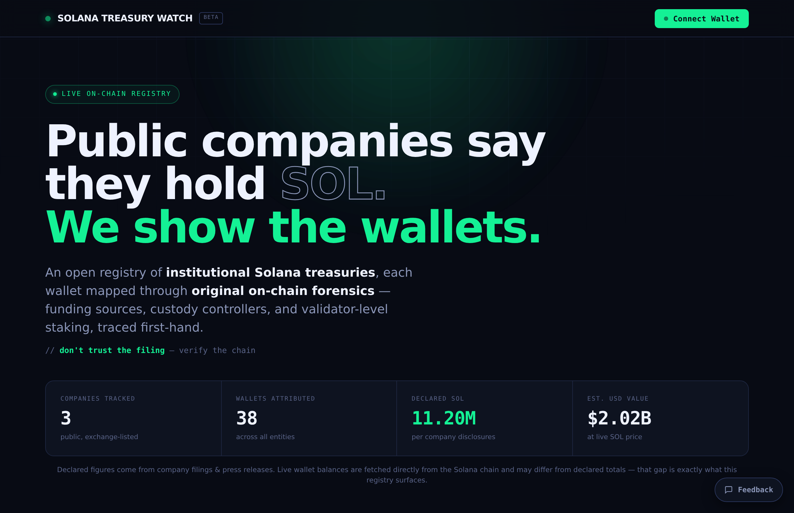

# Open Solana Intelligence (OSI)

**Institutions say they hold SOL. We show the wallets.**

Open, on-chain-verified intelligence on institutional Solana activity. Every wallet is mapped through first-hand forensics, matched to public disclosures, and rated by confidence, so anyone can check institutional SOL holdings for themselves instead of trusting a filing.

> `// don't trust the filing, verify the chain`

**Live:** https://solana-treasury-watch-wald.vercel.app/ &nbsp;·&nbsp; **Repo:** https://github.com/friendlyfiree/solana-treasury-watch

---

## What it is

Most trackers give you a number. OSI gives you the wallets behind the number: funding sources, custody controllers, and validator-level staking, with the evidence and a confidence label on every address.

Today it tracks **3 public companies** (Forward Industries, Solana Company / HSDT, Sharps Technology) across **38 attributed wallets**, with balances pulled live from the Solana chain. It is built to extend across the rest of institutional Solana: ETFs, foundations, VCs, DAOs, validators, liquid-staking protocols, and custodians.

The app is laid out as a dashboard with a left command bar:

- **Registry** is the wallets and the live stats.
- **Investigations** is the published case studies.
- **Methodology** is exactly how the attribution is done, in the open.
- **Community** is the contribution layer: bounty board, wallet requests, research submissions, and the researcher ladder.

## What makes it different

- **Original attribution, not relabeled data.** The wallet mapping is first-hand forensic work: funding traces, custody fingerprints, and stake clustering done from the raw chain. Where a set is community-aggregated rather than first-party, the entry says so.
- **A verification layer, not a claim.** Nothing is presented as absolute. Every wallet carries a confidence level: Verified, High confidence, or Publicly labeled.
- **Open methodology.** The full technique is published, step by step, so anyone can reproduce or challenge a result.
- **Live, not static.** Balances and the SOL price are fetched in real time. The gap between what is declared and what is on-chain is exactly what the registry surfaces.
- **A real Solana dApp.** Connect Phantom and signal demand or score a report with a verifiable on-chain memo. No fees are collected, only the standard network fee applies.
- **A real community layer.** Wallet requests and upvotes can be shared across everyone through an optional Supabase backend, and new requests are reviewed by a maintainer before they go public, so the board stays clean.

## Case studies

Each attribution comes with a full, reproducible write-up: a timeline, the evidence clusters, and links to the on-chain transactions.

- **Solana Company (HSDT)**, declared 2.3M SOL. The decisive link: a treasury wallet received 999,999 SOL directly from a Solana Foundation non-circulating-supply wallet, co-signed by the Genesis community-allocation vault, one day before the discount agreement was public. This sits alongside dual-validator (Helius + Twinstake) staking and a Coinbase-funded deposit cluster.
- **Sharps Technology (STSS)**, declared 2M SOL. Assets moved under Coinbase Prime custody control two days before the partnership was announced, with Jupiter staking appearing days earlier still: on-chain behavior that pre-empts the disclosure.

Every write-up carries the same honest caveat: the evidence converges, but clustering is not legal proof.

## Methodology (short version)

1. **Anchor on a disclosure**, an SEC filing or press release with a date and an amount.
2. **Match the funding flow**, the on-chain inflows whose timing and size line up with the disclosure.
3. **Fingerprint the custodian.** Coinbase Prime, Fireblocks, Anchorage, and BitGo each leave recognizable on-chain patterns.
4. **Cluster stake and deposit accounts** by shared authority and common funding.
5. **Cross-validate before labeling.** Require at least two independent signals, then assign a confidence level, not a verdict.

**Confidence taxonomy**

| Label | Meaning |
|---|---|
| **Verified** | A definitive on-chain link (for example, a direct transfer from a known Foundation or entity wallet). |
| **High confidence** | Strong evidentiary clustering, where timing, size, custody, and disclosure converge, but no single proof of ownership. |
| **Publicly labeled** | Disclosed by the entity or its custodian, relayed here and independently sanity-checked. |

> On-chain attribution is probabilistic. "High confidence" means the evidence strongly converges, not legal certainty. Any attribution here can be challenged with better evidence, in the open.

## Stack and data sources

No framework and no build step. The whole app is two static files: `index.html` (markup, styling, and logic) and `data.js` (all entity and wallet data, kept separate so anyone can audit or extend it without touching the app).

Everything the app reads is live and public:

- **Live balances, Helius.** Every wallet balance is fetched in real time from Solana mainnet through a [Helius](https://www.helius.dev) RPC endpoint, with the public `api.mainnet-beta.solana.com` node as an automatic fallback if Helius is ever unreachable. The Helius key shipped in the page is domain-locked, so it only works from the project's own origin.
- **Live price, CoinGecko.** The SOL price comes from the CoinGecko public API, so the gap between what is declared and what is on-chain is always shown in current dollars.
- **Wallet and on-chain actions, web3.js + Phantom.** Connecting a wallet and signing a "signal demand" or "score a report" action uses [`@solana/web3.js`](https://github.com/solana-labs/solana-web3.js) (v1.95.3) with Phantom. Each action writes a tiny on-chain memo and nothing else: no token transfer, no fee beyond the standard Solana network cost, and every action links straight to [Solscan](https://solscan.io) so it can be checked.
- **Form delivery, Formspree.** Analyst applications, wallet requests, research submissions, and the newsletter signup are all delivered to the maintainer's inbox through [Formspree](https://formspree.io). To run your own copy, swap in your own Formspree endpoint near the top of the script.
- **Optional shared board, Supabase.** Covered in the next section.

## How submissions and the community board work

The Community tab has four parts: a bounty board, a wallet-request board, a research-submission form, and the researcher ladder. The two that take input from visitors are built to stay clean and honest.

**Wallet requests.** Anyone can request that a company be investigated, and anyone can upvote a request to move it up the queue. By default this runs per-browser in local storage. When a Supabase project is connected (its URL and anon key filled in), the board goes global: requests and upvotes are shared by everyone, with one vote per browser. A brand-new request is not shown publicly the instant it is submitted. It lands in a pending state and appears only once the maintainer approves it in Supabase, which keeps the public board free of spam. If Supabase is not configured, or is momentarily unreachable, the app falls back to local storage and nothing breaks.

**Research submissions.** A submitted report drops into a review queue marked "pending review", tagged with the submitter's connected wallet, and a copy is emailed to the maintainer through Formspree. Nothing a visitor types is rendered as raw HTML, and only `http` and `https` links are accepted, so the board cannot be used for code injection.

Only the Supabase anon (public) key is ever placed in the page. It is meant to be public; row-level security and the maintainer-approval step are what actually govern what can be read or shown. The admin keys never touch the code.

## Run it

Two files served together: `index.html` and `data.js`, in the same folder. Deploy the folder to any static host (with Vercel, drag the folder in and deploy). To update the registry, edit `data.js`. No build, no backend required.

To turn on the shared community board, create a free Supabase project, run the SQL from the in-file setup note, and paste your project URL and anon key into the two constants near the top of the script.

## Contributing

New attributions are welcome, see [CONTRIBUTING.md](./CONTRIBUTING.md). The bar is deliberately high: every submitted wallet needs both an on-chain trail and an off-chain disclosure to match, plus a documented confidence level.

## Roadmap

**Live now.** The verified registry with live balances, the open methodology, the first two case studies, the on-chain dApp actions, and the community board with maintainer review. All public.

**Next 30 days, the operational push.**

- Turn the shared community board fully on, with global requests and upvotes, tested across devices.
- Add five to six more entities and case studies, starting with the digital-asset-treasury write-ups already in the pipeline.
- Reach past public companies into the wider institutional map with a first ETF, foundation, or validator entry.
- Publish the first Weekly Brief.

**Later, as the project grows.**

- Community-funded bounties: anyone opens a request, anyone backs it, and volunteer researchers claim it.
- Pooled on-chain escrow for those bounties, so backing is trustless.
- Portable on-chain researcher reputation, earned from published and verified work.

The 30-day list is deliberately small and achievable for a solo maintainer. The later list is the direction of travel, not a promise with a date.

## Disclaimer

This is research, not financial advice. Wallet attribution is inherently probabilistic; labels reflect evidentiary strength, not legal certainty. Always verify independently before acting.

## License

[MIT](./LICENSE)
