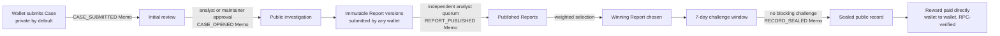

# OSI: Open Solana Intelligence

**An open, wallet-signed, community-reviewed intelligence desk for the Solana ecosystem.**

OSI turns public on-chain and open-source evidence into attributable, challengeable, verifiable incident records. Actor-authored writes are wallet-signed and server-verified; public governance outcomes are anchored to Solana mainnet. Independent analyst quorum is the standard publication path, while constitutionally limited cold-start outcomes are permanently labeled as maintainer bootstrap.

**Live:** https://open-solana-intel.vercel.app
**Verify it yourself:** [docs/VERIFY.md](docs/VERIFY.md) · **Real network size:** [docs/NETWORK_STATUS.md](docs/NETWORK_STATUS.md) · **Who builds this:** [docs/PROOF_OF_WORK.md](docs/PROOF_OF_WORK.md)

> Informational intelligence only. OSI is not legal or financial advice, holds no custody, guarantees no recovery, and never declares guilt. Attribution remains challengeable at all times.

[English] · [Türkçe](README.tr.md)

---

## The problem, with numbers

Solana has a wallet-victim problem that is measurable and getting worse, and almost none of those victims can reach a forensic analyst.

- **$3.4 billion** in crypto was stolen in 2025. Personal wallet compromises alone accounted for **158,000 incidents affecting at least 80,000 unique victims** and $713 million. ([Chainalysis 2026 Crypto Crime Report](https://www.chainalysis.com/blog/crypto-hacking-stolen-funds-2026/))
- In that data, **Solana had the largest number of personal wallet theft incidents of any chain, with roughly 26,500 victims** in 2025. ([Chainalysis 2026 Crypto Crime Report](https://www.chainalysis.com/blog/crypto-hacking-stolen-funds-2026/))
- Reporting scales with the losses and not with the help available: the FBI's IC3 logged **181,565 cryptocurrency fraud complaints totalling more than $11 billion** in 2025, up 22% year over year. ([FBI IC3 2025 Annual Report](https://www.ic3.gov/AnnualReport/Reports/2025_IC3Report.pdf))

Tens of thousands of Solana victims per year, and the professional forensics market is priced and structured for institutions. Skilled community analysts do genuinely good work, but they do it in private chats and closed marketplaces where it builds no portable public track record, and where the reasoning behind a conclusion is invisible and cannot be contested. Exchanges, compliance teams, and law enforcement receive scattered screenshots instead of structured, verifiable evidence.

The gap is not analytical talent. It is that there is no open place where an investigation can be **submitted, reviewed by independent people, published with its reasoning attached, contested, and permanently proven to have happened that way**.

OSI's answer is **process integrity**: a public system that proves who submitted what, which wallet signed which exact version, who reviewed it, what was decided, at what voting weight, whether it was challenged, and how it was sealed. OSI does not promise truth. It proves process, in public, on chain.

## What kind of project this is

OSI is an **ecosystem contribution and a public good**, not a growth product. It is MIT licensed, it is open source now rather than after some future milestone, it takes no custody, charges no fee, and takes no commission on any transfer. Its success measure is not revenue or user count. It is whether **independently authored intelligence can be published through independent review and verified by a third party who trusts nobody involved**, including the maintainer.

Concretely, three things in this repository are reusable by other Solana teams today, independently of OSI itself:

- **A working Solana Attestation Service integration**, including SDK-free PDA derivation and attestation evaluation that runs inside Edge runtime constraints, plus a standalone third-party audit script (`scripts/verify-sas-mainnet.mjs`).
- **A canonical, privacy-preserving on-chain memo grammar** for governance events, specified in [docs/OSI_V2_MEMO_EVENT_SPEC.md](docs/OSI_V2_MEMO_EVENT_SPEC.md).
- **A replay-resistant signed-write model** (the Stage-5 nonce, binding, and receipt design) with its pgTAP authorization suites, reusable by anyone building wallet-authenticated writes on Supabase.

## What is built and live

| Capability | Status |
|---|---|
| Case intake (private by default, wallet-signed, Memo-anchored) | Live |
| Case initial review and public opening | Live |
| Immutable Case Report versions with evidence manifests | Live |
| Weighted analyst review, quorum publication | Live |
| Resolution, 7-day challenge window, sealing | Live |
| Native SOL reward and voluntary support (non-custodial, RPC-verified) | Live |
| Solana Pay for exact single-recipient reward and support intents | Live |
| The Wire: standalone intelligence publication lane | Live |
| Analyst onboarding with on-chain SAS credentials and public verifier | Live |
| SAS credential enforcement in governance weight | Live |
| Shared private read session (30-minute inactivity window, 8-hour absolute lifetime) | Live |
| Owner-controlled wallet profiles and explicit public Case attribution | Live |
| Bootstrap governance (transparent, self-decaying cold-start mode) | Live |
| Maintainer-only AI Pack: private evidence-bound operational drafts | Live, private |
| Public AI Pack review, approval, and discovery | Not launched |
| Memo-anchored neutral public record references | Live |

## Where the network actually is

The platform is deployed and open for its first Cases. The network is at its honest cold start.

As of 2026-08-12: **3 public Cases, 2 published Case Reports, 0 published Wire Reports, 3 probationary analysts, 0 seals, 1 publication through an independent analyst quorum.** That one cleared the ordinary analyst path with two independent reviewers and the author excluded at the database boundary; its `REPORT_PUBLISHED` memo reads `r=analyst`. The other published Report went through the transparently labeled maintainer bootstrap channel and reads `r=maintainer`. So did the first winner selection, though its memo family carries no role field at all, so that role is recorded in the server-verified receipt rather than on chain; [docs/NETWORK_STATUS.md](docs/NETWORK_STATUS.md) states which is which. Both approving analysts sit at the probationary weight floor, so what is proven is that the path runs, not that it runs at earned weight.

That is stated up front rather than buried, because a project whose product is verifiable public record does not get to describe its own adoption in adjectives. The full breakdown, including what would have to change for those numbers to mean something, is in [docs/NETWORK_STATUS.md](docs/NETWORK_STATUS.md), and every figure in it is reproducible from the public endpoints in [docs/VERIFY.md](docs/VERIFY.md).

No invented activity, no vanity metrics, no fake wallets. Everything you see is either a real record or a truthful empty state.

## Where Solana is load-bearing

OSI is deliberate about what belongs on chain. Fast, private review and discussion run off chain where they should. Solana secures the parts where trust must become independently verifiable, and removing it would break the guarantee the product exists to make:

- **The public governance record is Memo-anchored on mainnet.** Case submission, public opening, report publication, and sealing are confirmed Solana Memo transactions under documented, versioned envelope profiles. The record is not OSI saying a thing happened; it is a transaction anyone can pull from the chain, and not even the maintainer can silently rewrite it.
- **Payments are non-custodial and RPC-verified.** Rewards and support are direct wallet-to-wallet SOL transfers through the System Program. A payment is labeled confirmed only after finalized mainnet verification of exact payer, recipients, lamports, and memo. OSI never holds funds.
- **Analyst authority is a portable on-chain credential.** Every active analyst holds a real Solana Attestation Service credential that any third party can verify directly against the chain, with no dependence on OSI's database. An analyst's standing survives even if OSI does not.

SAS is also a hard gate on governance weight: an analyst review contributes zero count and zero weight unless the exact live credential state is valid or a fresh trusted verification record proves it. Governance Memos carry a neutral public reference such as `OSI-...`; the identifier is resolvable through the public read API and contains no subject name or Case narrative.

## Verify it yourself

Nothing here asks for trust. Every claim on this page is checkable without a wallet, an account, an API key, or permission from anyone:

```bash
# is that analyst credential real, and does it really carry no personal data?
curl -s -X POST https://api.mainnet-beta.solana.com -H 'Content-Type: application/json' -d '{
  "jsonrpc":"2.0","id":1,"method":"getAccountInfo",
  "params":["897TYTVN9aQfLWj2BJyhByQawsSuydLZcTpanZWCtxKz",{"encoding":"base64"}]
}' | python3 -c "import base64,json,sys; \
print(base64.b64decode(json.load(sys.stdin)['result']['value']['data'][0]).decode('utf-8','replace'))"
```

That returns the on-chain schema: the name `OSI_VERIFIED_ANALYST`, the fields `tier` and `status`, and the privacy statement `No PII, no case data.` written into the account itself.

[docs/VERIFY.md](docs/VERIFY.md) has the rest: reading governance memos off mainnet, confirming default-deny from outside the system, holding the running configuration to its own documentation, and a one-command full credential audit that imports the same decision core production runs.

## How a Case works


```mermaid
flowchart LR
    A[Wallet submits Case\nprivate by default] -->|CASE_SUBMITTED Memo| B[Initial review]
    B -->|analyst or maintainer approval\nCASE_OPENED Memo| C[Public investigation]
    C --> D[Immutable Report versions\nsubmitted by any wallet]
    D -->|independent analyst quorum\nREPORT_PUBLISHED Memo| E[Published Reports]
    E -->|weighted selection| F[Winning Report chosen]
    F --> G[7-day challenge window]
    G -->|no blocking challenge\nRECORD_SEALED Memo| H[Sealed public record]
    H --> I[Reward paid directly\nwallet to wallet, RPC-verified]
```

Every arrow above is backed by a wallet signature or a confirmed Solana Memo transaction. Nothing advances silently.

## Two lanes, one product

**Field Office** is investigation-first. A Case starts with a question or an incident, usually with an owner, optionally with a pledged reward, and ends in a sealed, challengeable public record.

**The Wire** is finding-first. Any connected wallet can submit standalone intelligence: wallet clusters, fund-flow analyses, treasury research, verification of public claims. No victim or open Case is required. Wire Reports go through the same immutable versioning and independent review before publication, and a published finding can be promoted into a full Case when it deserves deeper investigation.

## The proof model

OSI never blurs the line between different kinds of evidence. Every receipt in the Proof Log carries exactly one honest label:

1. **Memo-anchored on Solana**: a confirmed mainnet transaction using the canonical OSI2 memo grammar. Used for public governance outcomes such as CASE_SUBMITTED, CASE_OPENED, REPORT_PUBLISHED, WIRE_REPORT_PUBLISHED, RECORD_SEALED.
2. **Wallet-signed and server-verified**: an Ed25519 signMessage receipt verified server-side. Used for individual decisions such as reviews. Never presented as on-chain.
3. **System event**: a server-generated state transition.
4. **Legacy import, not server-verified**: historical V1 data, always visibly distinct.

Every signed write is protected by a five-stage replay defense: a cryptographically random single-use server nonce, short expiry, exact purpose and target binding, canonical payload hash, and atomic consumption with idempotent retry. A stateless nonce check is forbidden by design.

## Analyst network and on-chain credentials

Analyst authority is earned through a reviewed, attributable process rather than self-asserted. Two onboarding paths exist: a direct wallet-signed application reviewed through immutable version history, and automatic candidacy earned when a wallet's report wins a resolved Case. Voting power is bounded between 0.50 and 3.00 and grows only through a documented tier ladder based on accepted contributions and review quality. No payment, donation, or support ever influences weight, ranking, or governance.

Every active analyst holds a real, revocable **Solana Attestation Service (SAS)** credential on mainnet, issued automatically at activation and revoked on demotion. Anyone, including third-party applications and reviewers with no wallet of their own, can verify a wallet's analyst status directly against Solana without trusting OSI's database, through the public verifier on the About page or against the chain directly:

- SAS Program: [`22zoJMtdu4tQc2PzL74ZUT7FrwgB1Udec8DdW4yw4BdG`](https://solscan.io/account/22zoJMtdu4tQc2PzL74ZUT7FrwgB1Udec8DdW4yw4BdG)
- OSI Credential: [`D2tsrEHEXYPL82chv5PuwsQtALv1i5hXrWZorqyefJgX`](https://solscan.io/account/D2tsrEHEXYPL82chv5PuwsQtALv1i5hXrWZorqyefJgX)
- OSI_VERIFIED_ANALYST Schema: [`897TYTVN9aQfLWj2BJyhByQawsSuydLZcTpanZWCtxKz`](https://solscan.io/account/897TYTVN9aQfLWj2BJyhByQawsSuydLZcTpanZWCtxKz)

The schema stores only integer tier and status codes. No names, no personal data, no case content ever goes on chain.

## Governance that cannot be faked

Critical outcomes require both a minimum count of independent analysts and a minimum total voting weight. A single analyst can never decide a critical outcome alone, even at maximum weight. Authors can never review their own work; this is enforced at the database boundary, not just in the interface.

During the network's cold start, a transparent **bootstrap mode** lets the double-authenticated maintainer advance publications, winner selections, and seals. Every such decision is permanently recorded on a distinct `maintainer_bootstrap` channel and is never presented as analyst consensus. The mode dismantles itself in code as the real network grows: at 20 eligible analysts the maintainer needs an independent analyst alongside every decision, at 30 two analysts, and at 50 the mode retires entirely and the original thresholds take over. The tier is computed by the server from the live eligible-analyst count rather than set by a manual flag, so the privilege decays on schedule without anyone having to be trusted to give it up. Challenge verdicts and AI Pack approvals are never available to bootstrap under any circumstances.

## Maintainer-only AI Pack

An AI Pack is a versioned, evidence-bound intelligence brief generated from server-approved Case evidence. It is an artifact, never a verdict: OSI displays a component Evidence Confidence Profile and never a single accuracy, truth, guilt, or legal-certainty score. Each immutable version carries three separately hashed content layers and a reproducible evidence manifest. Generation runs entirely server-side under strict rate, quota, cooldown, input, output, timeout, and cost limits; no provider key reaches the browser.

The production launch mode is deliberately narrower than the future governed model. Only the configured admin wallet combined with the authenticated Supabase maintainer identity can discover, generate, or inspect a Pack. Generated Packs remain private operational drafts. Case owners, analysts, half-maintainers, and public users see no AI Pack control or restricted content and cannot spend provider quota. Review, owner feedback, approval, publication, and public discovery remain disabled until an independent SAS-valid analyst quorum path is separately launched.

## Payments without custody

Rewards and voluntary support are direct wallet-to-wallet native SOL transfers through the Solana System Program. OSI never holds funds, takes no commission, and never signs on a user's behalf. A payment is labeled confirmed only after trusted server code verifies the finalized transaction on mainnet RPC: exact payer, exact recipients, exact lamports, canonical memo, and replay binding. A pledged reward can only be paid after sealing, only to the exact winning report author, and never above the frozen pledge.

After the server prepares the exact V2 intent, the review screen shows network, purpose, recipients, amounts, canonical Memo, irreversibility, and the no-custody boundary. Phantom remains the atomic transaction path for every supported manifest. Exact single-recipient intents additionally offer Solana Pay with a local QR and an explicit copy/open link. Its unique 32-byte reference is server-bound to the nonce, payer, target, manifest, lamports, Memo, mainnet, expiry, and idempotency key. Scanning or opening a wallet never marks payment; both methods converge on the same finalized server verification and receipt commit. Multi-recipient support remains Phantom-only so atomicity is never split.

## Architecture

```
Browser (static HTML/CSS/JS, no build step, no framework)
   |  Phantom wallet: connect, signMessage, transactions
   v
Supabase Edge Functions (Deno)          Solana mainnet
   osi-v2-case-read / case-write   <->  Memo program (OSI2 grammar)
   osi-v2-report-read / report-write    System Program transfers
   osi-v2-governance-write              SAS attestations
   osi-v2-wire, osi-v2-payment
   osi-v2-analyst, osi-v2-proof, AI Pack
   |  service-only RPCs, Stage-5 proofs
   v
PostgreSQL (Supabase)
   32 domain tables, FORCE row level security, default deny
   append-only reviews, immutable versions, event receipts
```

Key properties:

- **Default deny across V2.** Browsers hold no privileged database access. Every client-reachable V2 domain table has forced row level security with zero anonymous policies; V2 mutations flow through service-only RPCs behind wallet proofs. The frozen V1 compatibility tables are documented separately in [docs/VERIFY.md](docs/VERIFY.md) section 6.
- **Immutability by construction.** Published versions, reviews, and receipts are append-only. Corrections create new versions; history is never rewritten. This is enforced by database triggers, not convention: even the maintainer cannot delete or silently alter a sealed record or a Case's provenance.
- **Fail-closed feature flags.** Every capability ships behind a dedicated flag that treats a missing or malformed value as off.
- **Honest UI.** Every visible control maps to a real authorized endpoint. Disabled features state their exact unmet prerequisite. Empty states never invent activity.

See [docs/ARCHITECTURE.md](docs/ARCHITECTURE.md) for the full map, [docs/USER_GUIDE.md](docs/USER_GUIDE.md) for the role-by-role handbook, and [docs/OSI_PRODUCTION_FEATURE_STATUS.md](docs/OSI_PRODUCTION_FEATURE_STATUS.md) for the exact live/false/dormant gate classification.

## Who builds this

OSI is built and maintained by **Aksusarya**, an independent on-chain intelligence analyst. The project is a direct product of that work: paid attribution research and intelligence reports that were real, market-validated, and yet scattered across private buyers with no portable public track record and no reviewable process behind the conclusions.

The verifiable record is in [docs/PROOF_OF_WORK.md](docs/PROOF_OF_WORK.md): 54 bounty payout transactions, 26 paid intelligence report sales, 9 named marketplace research listings, and Solana-focused investigative submissions on Superteam Earn, every one of them resolving to a public transaction or listing.

OSI is engineered with AI assistance under the explicit contract in [AGENTS.md](AGENTS.md), which is public for the same reason everything else here is. That approach is not defended by assertion. It is defended by checkable evidence: the code is MIT and public, authorization boundaries are covered by pgTAP suites against a database built from zero, the governance and payment decision cores are tested as shipped, and every claim of mainnet anchoring resolves to a transaction a stranger can inspect. Off-chain claims remain distinguishable and are checked through public APIs, receipts, and tests. See [AGENTS.md](AGENTS.md) section 15.

**Bus factor is currently one, and that is a real risk rather than a rhetorical one.** The code, schema, migrations, and rebuild path are public; analyst credentials remain verifiable on Solana; and bootstrap privilege expires on an automatic ladder rather than the maintainer's goodwill. Public record bodies still depend on the deployed database until permanent external storage launches, so this risk is bounded but not eliminated. Maintainer continuity is addressed in [SECURITY.md](SECURITY.md).

## In active development

These are the current build priorities. Each deepens the role Solana already plays rather than adding misleading surface:

- **Governed AI Pack review and publication.** Private maintainer generation is live. Public release remains intentionally absent until independent SAS-valid analysts can review exact immutable versions, meet both count and weight gates, and exclude the creator. Bootstrap governance will never substitute for this quorum.
- **Durable public record.** Sealed Cases mirrored to permanent content-addressed storage (Arweave), paid in SOL, with the content hash anchored by Memo, so the public record outlives any single database.

## Repository structure

```
index.html              Main application shell
assets/css/             Modular stylesheets (design token system)
assets/js/              Classic JS modules (wallet, workspaces, integrations)
supabase/migrations/    Ordered, additive SQL migrations
supabase/functions/     Deno Edge Functions and shared cores
supabase/tests/         pgTAP authorization and lifecycle suites
tests/                  Dependency-free Node suites, browser E2E, concurrency
docs/                   Product constitution, domain model, state machines,
                        role matrix, decision register, guides, verification
.github/workflows/      The validation gate plus reusable deploy and audit tools
.github/workflows/archive/  Completed one-shot production rollouts, kept as the
                        audit trail and disabled by living in a subdirectory
tools/                  One-time maintainer utilities (SAS setup)
scripts/                Third-party-runnable audit scripts
```

Start here, depending on what you want:

| You want to | Read |
|---|---|
| Check whether any of this is true | [docs/VERIFY.md](docs/VERIFY.md) |
| Know how big the network really is | [docs/NETWORK_STATUS.md](docs/NETWORK_STATUS.md) |
| Understand the rules the code must obey | [docs/OSI_V2_PRODUCT_CONSTITUTION.md](docs/OSI_V2_PRODUCT_CONSTITUTION.md) |
| Understand the machinery | [docs/ARCHITECTURE.md](docs/ARCHITECTURE.md) |
| Use the product | [docs/USER_GUIDE.md](docs/USER_GUIDE.md) |
| Run your own instance | [docs/SELF_HOSTING.md](docs/SELF_HOSTING.md) |
| Answer or correct a record about you | [docs/RIGHT_OF_REPLY.md](docs/RIGHT_OF_REPLY.md) |
| Contribute code | [CONTRIBUTING.md](CONTRIBUTING.md) and [AGENTS.md](AGENTS.md) |
| Report a vulnerability | [SECURITY.md](SECURITY.md) |

## Testing and delivery discipline

Every change passes a full battery before reaching production: every dependency-free Node suite in `tests/`, Deno type checks, a clean PostgreSQL migration from zero, database lint at error level, pgTAP authorization tests for every role, two-connection replay and race tests, stored-XSS regression coverage, and browser contracts at desktop and 390px mobile. Production rollouts run only through typed-confirmation, main-only workflows that dry-run the exact expected migrations, snapshot every feature flag and row count before and after, and fail closed by disabling only the affected flag.

"Every suite" is enforced rather than intended: CI discovers the Node suites by glob and refuses to run at all if it finds fewer than it expects, so a suite added in a later slice cannot quietly stop being part of the gate. Documentation is held to the same standard by `tests/osi-docs-integrity.test.mjs`, which fails the build on a broken internal link, an inconsistent on-chain address, or a claimed count that does not match the evidence listed under it.

## If a record names you

OSI publishes reviewed observations about public evidence, never verdicts, and attribution stays challengeable permanently. If a record names you or your organisation, [docs/RIGHT_OF_REPLY.md](docs/RIGHT_OF_REPLY.md) sets out three routes to answer it, including one that needs no wallet and no account, what OSI will do in each case, and how personal data and erasure are handled against an append-only record.

## Roadmap

Beyond the active work above, in no committed order:

- Reputation progression: automatic tier advancement from accepted contributions and review accuracy, with public analyst CV pages.
- Notifications and My OSI: actionable indicators for reward due, revision requested, challenge opened, and seal ready.
- Public metrics: independently verifiable network statistics with no vanity numbers.
- Community handover: progressive retirement of every remaining maintainer privilege as the analyst network grows.

## Contributing

Contributions are welcome. Start with [CONTRIBUTING.md](CONTRIBUTING.md), the engineering contract in [AGENTS.md](AGENTS.md), and the decision register in [docs/OSI_V2_OPEN_DECISIONS.md](docs/OSI_V2_OPEN_DECISIONS.md). Security reports go through [SECURITY.md](SECURITY.md), never public issues.

## License

[MIT](LICENSE)

---

**Built on Solana. Verified by wallets. Reviewed by people.**
