# OSI: Open Solana Intelligence

**Solana ekosistemi için açık, cüzdan imzalı, toplulukça incelenen bir istihbarat masası.**

OSI, kamuya açık zincir üstü ve açık kaynak delilleri; kime ait olduğu belli, itiraz edilebilir ve doğrulanabilir olay kayıtlarına dönüştürür. Kullanıcı eylemleri cüzdanla imzalanıp sunucuda doğrulanır; kamusal yönetişim sonuçları Solana mainnet'e çapalanır. Standart yayımlama yolu bağımsız analist yeter sayısıdır; anayasal olarak sınırlı soğuk başlangıç sonuçları ise kalıcı biçimde sürdürücü başlangıcı olarak etiketlenir.

**Canlı:** https://open-solana-intel.vercel.app
**Kendin doğrula:** [docs/VERIFY.md](docs/VERIFY.md) · **Gerçek ağ büyüklüğü:** [docs/NETWORK_STATUS.md](docs/NETWORK_STATUS.md) · **Bunu kim geliştiriyor:** [docs/PROOF_OF_WORK.md](docs/PROOF_OF_WORK.md)

> Yalnızca bilgilendirme amaçlı istihbarattır. OSI hukuki veya finansal tavsiye vermez, hiçbir varlığı emanet almaz, geri kazanım garanti etmez ve asla suçluluk ilan etmez. Atıf her zaman itiraz edilebilir kalır.

[English](README.md) · [Türkçe]

---

## Problem, rakamlarla

Solana'nın ölçülebilir ve büyüyen bir cüzdan mağduru problemi var ve bu mağdurların neredeyse hiçbiri bir adli analiste ulaşamıyor.

- 2025'te kripto varlıklardan **3,4 milyar dolar** çalındı. Tek başına kişisel cüzdan ele geçirmeleri **158.000 olay ve en az 80.000 benzersiz mağdur** ile 713 milyon dolar tutuyor. ([Chainalysis 2026 Crypto Crime Report](https://www.chainalysis.com/blog/crypto-hacking-stolen-funds-2026/))
- Aynı veride **Solana, kişisel cüzdan hırsızlığında yaklaşık 26.500 mağdurla tüm zincirler arasında en yüksek olay sayısına** sahip. ([Chainalysis 2026 Crypto Crime Report](https://www.chainalysis.com/blog/crypto-hacking-stolen-funds-2026/))
- Bildirimler kayıplarla birlikte büyüyor, ama ulaşılabilir yardımla değil: FBI IC3, 2025'te **181.565 kripto dolandırıcılık şikâyeti ve 11 milyar doları aşan kayıp** kaydetti, bir önceki yıla göre %22 artış. ([FBI IC3 2025 Annual Report](https://www.ic3.gov/AnnualReport/Reports/2025_IC3Report.pdf))

Yılda on binlerce Solana mağduru var ve profesyonel adli inceleme piyasası fiyatıyla da yapısıyla da kurumlara göre kurulmuş. Yetenekli topluluk analistleri gerçekten iyi iş çıkarıyor, ama bunu özel sohbetlerde ve kapalı pazar yerlerinde yapıyorlar: taşınabilir bir kamusal sicil oluşmuyor ve bir sonuca nasıl varıldığı görünmediği için itiraz da edilemiyor. Borsalar, uyum ekipleri ve kolluk ise yapılandırılmış ve doğrulanabilir delil yerine dağınık ekran görüntüleri alıyor.

Eksik olan analitik yetenek değil. Eksik olan, bir incelemenin **gönderilebildiği, bağımsız kişilerce değerlendirildiği, gerekçesiyle birlikte yayımlandığı, itiraz edilebildiği ve tam olarak böyle olduğu kalıcı biçimde kanıtlanabildiği** açık bir yer.

OSI'nin cevabı **süreç bütünlüğüdür**: kimin neyi gönderdiğini, hangi cüzdanın tam olarak hangi sürümü imzaladığını, kimin incelediğini, ne karar verildiğini, hangi oy ağırlığıyla, itiraz edilip edilmediğini ve nasıl mühürlendiğini kamuya kanıtlayan bir sistem. OSI hakikat vaat etmez. Süreci kanıtlar: açıkça ve zincir üstünde.

## Bu nasıl bir proje

OSI bir **ekosistem katkısı ve kamu malıdır**, bir büyüme ürünü değil. MIT lisanslıdır, ileride bir aşamada değil şimdiden açık kaynaktır, hiçbir varlığı emanet almaz, ücret almaz ve hiçbir transferden komisyon kesmez. Başarı ölçütü gelir ya da kullanıcı sayısı değildir. Ölçüt şudur: **bağımsız olarak yazılmış istihbarat, bağımsız bir inceleme sürecinden geçip, sürece dahil hiç kimseye güvenmeyen üçüncü bir taraf tarafından doğrulanabiliyor mu**, buna sürdürücü de dahil.

Somut olarak, bu depoda üç şey OSI'den bağımsız şekilde bugün diğer Solana ekiplerince yeniden kullanılabilir:

- **Çalışan bir Solana Attestation Service entegrasyonu.** SDK'sız PDA türetme ve Edge çalışma zamanı kısıtları içinde çalışan attestation değerlendirme mantığı, ayrıca bağımsız üçüncü tarafların çalıştırabileceği denetim betiği (`scripts/verify-sas-mainnet.mjs`).
- **Kanonik ve gizliliği koruyan bir zincir üstü memo grameri.** Yönetişim olayları için, [docs/OSI_V2_MEMO_EVENT_SPEC.md](docs/OSI_V2_MEMO_EVENT_SPEC.md) içinde tanımlı.
- **Tekrar saldırılarına dayanıklı imzalı yazma modeli.** Stage-5 nonce, bağlama ve makbuz tasarımı, pgTAP yetki süitleriyle birlikte. Supabase üzerinde cüzdanla kimlik doğrulanan yazma işlemi kuran herkes kullanabilir.

## Yapılmış ve canlı olanlar

| Yetenek | Durum |
|---|---|
| Vaka girişi (varsayılan gizli, cüzdan imzalı, Memo çapalı) | Canlı |
| Vaka ilk incelemesi ve kamuya açılması | Canlı |
| Delil manifestli, değiştirilemez Vaka Raporu sürümleri | Canlı |
| Ağırlıklı analist incelemesi, yeter sayı ile yayımlama | Canlı |
| Çözüm, 7 günlük itiraz penceresi, mühürleme | Canlı |
| Yerel SOL ödülü ve gönüllü destek (emanetsiz, RPC doğrulamalı) | Canlı |
| Tek alıcılı kesin ödül ve destek niyetleri için Solana Pay | Canlı |
| The Wire: bağımsız istihbarat yayımlama şeridi | Canlı |
| Zincir üstü SAS kimlik bilgisi ve kamusal doğrulayıcı ile analist kaydı | Canlı |
| Yönetişim ağırlığında SAS kimlik bilgisi zorunluluğu | Canlı |
| Paylaşımlı gizli okuma oturumu (30 dakika hareketsizlik, 8 saat mutlak ömür) | Canlı |
| Başlangıç (bootstrap) yönetişimi: şeffaf, kendi kendini söndüren soğuk başlangıç modu | Canlı |
| Yalnızca sürdürücüye açık AI Pack: delile bağlı özel operasyonel taslaklar | Canlı, özel |
| Kamusal AI Pack incelemesi, onayı ve keşfi | Başlatılmadı |
| Memo çapalı tarafsız kamusal kayıt referansları | Canlı |

## Ağın gerçekte nerede olduğu

Platform yayında ve ilk vakalarına açık. Ağ ise dürüst bir soğuk başlangıçta.

2026-08-08 itibarıyla: **3 kamuya açık Vaka, 1 yayımlanmış Vaka Raporu, 0 yayımlanmış Wire Raporu, 3 deneme süreli analist, 0 mühür, bağımsız analist yeter sayısı ile 0 yayımlama.** Yayımlanmış tek Rapor, şeffaf şekilde etiketlenmiş sürdürücü başlangıç kanalından çıktı; bu, `REPORT_PUBLISHED` memo'sunda `r=maintainer` olarak zincir üstünde görülebiliyor.

Bu bilgi gizlenmek yerine en başta veriliyor, çünkü ürünü doğrulanabilir kamusal kayıt olan bir proje kendi benimsenmesini sıfatlarla anlatamaz. Tam döküm ve bu sayıların anlam kazanması için nelerin değişmesi gerektiği [docs/NETWORK_STATUS.md](docs/NETWORK_STATUS.md) içinde; oradaki her rakam [docs/VERIFY.md](docs/VERIFY.md) bölüm 5'teki kamusal uçlardan yeniden üretilebilir.

Uydurulmuş aktivite yok, gösteriş metriği yok, sahte cüzdan yok. Gördüğünüz her şey ya gerçek bir kayıttır ya da dürüst bir boş durumdur.

## Solana'nın taşıyıcı olduğu yerler

OSI, neyin zincire ait olduğu konusunda kasıtlı davranır. Hızlı ve gizli inceleme ile tartışma, olması gerektiği gibi zincir dışında çalışır. Solana ise güvenin bağımsız olarak doğrulanabilir hale gelmesi gereken kısımları güvenceye alır; çıkarılırsa ürünün var olma amacı olan garanti çöker:

- **Kamusal yönetişim kaydı mainnet'te Memo ile çapalıdır.** Vaka gönderimi, kamuya açılma, rapor yayımı ve mühürleme; kanonik bir gramerle yazılmış, onaylanmış Solana Memo işlemleridir. Kayıt, OSI'nin "şu oldu" demesi değildir; herkesin zincirden çekebileceği bir işlemdir ve sürdürücü bile onu sessizce yeniden yazamaz.
- **Ödemeler emanetsizdir ve RPC ile doğrulanır.** Ödüller ve destekler, System Program üzerinden doğrudan cüzdandan cüzdana SOL transferleridir. Bir ödeme, yalnızca kesin ödeyen, alıcılar, lamport ve memo mainnet'te finalize edilmiş olarak doğrulandıktan sonra onaylı olarak etiketlenir. OSI hiçbir zaman fon tutmaz.
- **Analist yetkisi taşınabilir bir zincir üstü kimlik bilgisidir.** Aktif her analist, üçüncü tarafların OSI veritabanına hiç bağımlı olmadan doğrudan zincire karşı doğrulayabileceği gerçek bir Solana Attestation Service kimlik bilgisi taşır. Bir analistin konumu, OSI ortadan kalksa bile ayakta kalır.

SAS aynı zamanda yönetişim ağırlığı üzerinde sert bir kapıdır: canlı kimlik bilgisi durumu geçerli değilse veya taze güvenilir bir doğrulama kaydı bunu kanıtlamıyorsa, bir analist incelemesi sıfır sayı ve sıfır ağırlık taşır.

## Kendin doğrula

Burada hiçbir şey güven istemez. Bu sayfadaki her iddia; cüzdan, hesap, API anahtarı veya kimseden izin olmadan kontrol edilebilir:

```bash
# o analist kimlik bilgisi gerçek mi ve gerçekten kişisel veri taşımıyor mu?
curl -s -X POST https://api.mainnet-beta.solana.com -H 'Content-Type: application/json' -d '{
  "jsonrpc":"2.0","id":1,"method":"getAccountInfo",
  "params":["897TYTVN9aQfLWj2BJyhByQawsSuydLZcTpanZWCtxKz",{"encoding":"base64"}]
}' | python3 -c "import base64,json,sys; \
print(base64.b64decode(json.load(sys.stdin)['result']['value']['data'][0]).decode('utf-8','replace'))"
```

Bu komut zincir üstündeki şemayı döndürür: `OSI_VERIFIED_ANALYST` adı, `tier` ve `status` alanları ve hesabın kendi içine yazılmış `No PII, no case data.` gizlilik beyanı.

Geri kalanı [docs/VERIFY.md](docs/VERIFY.md) içinde: yönetişim memo'larını mainnet'ten okuma, varsayılan reddetme politikasını sistemin dışından test etme, çalışan yapılandırmayı kendi dokümantasyonuna karşı tutma ve üretimin çalıştırdığı karar çekirdeğinin aynısını içe aktaran tek komutluk tam kimlik denetimi.

## Bir Vaka nasıl işler

```mermaid
flowchart LR
    A[Cüzdan Vaka gönderir\nvarsayılan gizli] -->|CASE_SUBMITTED Memo| B[İlk inceleme]
    B -->|analist veya sürdürücü onayı\nCASE_OPENED Memo| C[Kamusal soruşturma]
    C --> D[Değiştirilemez Rapor sürümleri\nher cüzdan gönderebilir]
    D -->|bağımsız analist yeter sayısı\nREPORT_PUBLISHED Memo| E[Yayımlanmış Raporlar]
    E -->|ağırlıklı seçim| F[Kazanan Rapor seçilir]
    F --> G[7 günlük itiraz penceresi]
    G -->|engelleyici itiraz yoksa\nRECORD_SEALED Memo| H[Mühürlenmiş kamusal kayıt]
    H --> I[Ödül doğrudan ödenir\ncüzdandan cüzdana, RPC doğrulamalı]
```



Yukarıdaki her ok, bir cüzdan imzası veya onaylanmış bir Solana Memo işlemiyle desteklenir. Hiçbir adım sessizce ilerlemez.

## İki şerit, tek ürün

**Field Office** soruşturma önceliklidir. Bir Vaka, bir soru veya olayla başlar, genelde bir sahibi vardır, isteğe bağlı bir ödül taahhüdü taşır ve mühürlenmiş, itiraz edilebilir bir kamusal kayıtla biter.

**The Wire** bulgu önceliklidir. Bağlı herhangi bir cüzdan bağımsız istihbarat gönderebilir: cüzdan kümeleri, fon akışı analizleri, hazine araştırması, kamusal iddiaların doğrulanması. Mağdur veya açık bir Vaka gerekmez. Wire Raporları da aynı değiştirilemez sürümleme ve bağımsız inceleme sürecinden geçer; yayımlanan bir bulgu, daha derin soruşturmayı hak ettiğinde tam bir Vakaya yükseltilebilir.

## Kanıt modeli

OSI farklı delil türleri arasındaki çizgiyi asla bulanıklaştırmaz. Kanıt Kütüğü'ndeki her makbuz tam olarak tek bir dürüst etiket taşır:

1. **Solana'da Memo çapalı**: kanonik OSI2 memo grameriyle onaylanmış mainnet işlemi. CASE_SUBMITTED, CASE_OPENED, REPORT_PUBLISHED, WIRE_REPORT_PUBLISHED, RECORD_SEALED gibi kamusal yönetişim sonuçları için.
2. **Cüzdan imzalı ve sunucuda doğrulanmış**: sunucu tarafında doğrulanan Ed25519 signMessage makbuzu. İncelemeler gibi bireysel kararlar için. Asla zincir üstü olarak sunulmaz.
3. **Sistem olayı**: sunucunun ürettiği bir durum geçişi.
4. **Legacy içe aktarım, sunucuda doğrulanmamış**: geçmiş V1 verisi, her zaman görsel olarak ayrı.

İmzalı her yazma beş aşamalı bir tekrar savunmasıyla korunur: kriptografik olarak rastgele, tek kullanımlık sunucu nonce'ı, kısa geçerlilik, kesin amaç ve hedef bağlaması, kanonik yük özeti ve idempotent yeniden denemeyle atomik tüketim. Durumsuz nonce kontrolü tasarım gereği yasaktır.

## Analist ağı ve zincir üstü kimlik bilgileri

Analist yetkisi kişinin kendi beyanıyla değil, incelenen ve kime ait olduğu belli bir süreçle kazanılır. İki kayıt yolu vardır: değiştirilemez sürüm geçmişi üzerinden incelenen doğrudan cüzdan imzalı başvuru ve bir cüzdanın raporunun çözülmüş bir Vakayı kazanmasıyla otomatik adaylık. Oy gücü 0,50 ile 3,00 arasında sınırlıdır ve yalnızca kabul edilen katkılar ile inceleme kalitesine dayalı, belgelenmiş bir kademe merdiveniyle artar. Hiçbir ödeme, bağış veya destek ağırlığı, sıralamayı veya yönetişimi etkilemez.

Aktif her analist mainnet üzerinde gerçek ve geri alınabilir bir **Solana Attestation Service (SAS)** kimlik bilgisi taşır; aktivasyonda otomatik verilir, rütbe düşümünde geri alınır. Kendi cüzdanı olmayanlar dahil herkes, bir cüzdanın analist konumunu OSI veritabanına güvenmeden doğrudan Solana'ya karşı doğrulayabilir:

- SAS Programı: [`22zoJMtdu4tQc2PzL74ZUT7FrwgB1Udec8DdW4yw4BdG`](https://solscan.io/account/22zoJMtdu4tQc2PzL74ZUT7FrwgB1Udec8DdW4yw4BdG)
- OSI Credential: [`D2tsrEHEXYPL82chv5PuwsQtALv1i5hXrWZorqyefJgX`](https://solscan.io/account/D2tsrEHEXYPL82chv5PuwsQtALv1i5hXrWZorqyefJgX)
- OSI_VERIFIED_ANALYST Şeması: [`897TYTVN9aQfLWj2BJyhByQawsSuydLZcTpanZWCtxKz`](https://solscan.io/account/897TYTVN9aQfLWj2BJyhByQawsSuydLZcTpanZWCtxKz)

Şema yalnızca tamsayı kademe ve durum kodlarını saklar. Zincire asla isim, kişisel veri veya vaka içeriği yazılmaz.

## Taklit edilemeyen yönetişim

Kritik sonuçlar hem asgari bağımsız analist sayısını hem de asgari toplam oy ağırlığını gerektirir. Tek bir analist, azami ağırlıkta bile kritik bir sonucu tek başına karara bağlayamaz. Yazarlar kendi işlerini asla inceleyemez; bu yalnızca arayüzde değil, veritabanı sınırında zorlanır.

Ağın soğuk başlangıcı boyunca şeffaf bir **başlangıç (bootstrap) modu**, çift kimlik doğrulamalı sürdürücünün yayımlama, kazanan seçimi ve mühürleme işlemlerini ilerletmesine izin verir. Böyle her karar kalıcı olarak ayrı bir `maintainer_bootstrap` kanalına yazılır ve asla analist mutabakatı olarak sunulmaz. Mod, gerçek ağ büyüdükçe kodda kendini söker: 20 uygun analistte sürdürücünün her karar için yanında bağımsız bir analist gerekir, 30'da iki analist, 50'de mod tamamen emekli olur ve orijinal eşikler devreye girer. Kademe, elle bir bayrak değiştirilerek değil, sunucu tarafından canlı uygun analist sayısından hesaplanır; yani ayrıcalık, kimsenin onu bırakacağına güvenilmesi gerekmeden zamanında söner. İtiraz kararları ve AI Pack onayları hiçbir koşulda başlangıç moduna açık değildir.

## Emanetsiz ödemeler

Ödüller ve gönüllü destek, Solana System Program üzerinden doğrudan cüzdandan cüzdana yerel SOL transferleridir. OSI asla fon tutmaz, komisyon almaz ve kullanıcı adına imza atmaz. Bir ödeme yalnızca güvenilir sunucu kodu, finalize edilmiş işlemi mainnet RPC üzerinde doğruladıktan sonra onaylı sayılır: kesin ödeyen, kesin alıcılar, kesin lamport, kanonik memo ve tekrar bağlaması. Taahhüt edilmiş bir ödül yalnızca mühürlemeden sonra, yalnızca kazanan rapor yazarına ve asla dondurulmuş taahhüdün üzerinde ödenemez.

## Mimari

```
Tarayıcı (statik HTML/CSS/JS, derleme adımı yok, framework yok)
   |  Phantom cüzdanı: bağlan, signMessage, işlemler
   v
Supabase Edge Functions (Deno)          Solana mainnet
   osi-v2-case-read / case-write   <->  Memo programı (OSI2 grameri)
   osi-v2-report-read / report-write    System Program transferleri
   osi-v2-governance-write              SAS attestation'ları
   osi-v2-wire, osi-v2-payment
   osi-v2-analyst, osi-v2-proof, AI Pack
   |  yalnızca servis rolüne açık RPC'ler, Stage-5 kanıtları
   v
PostgreSQL (Supabase)
   32 alan tablosu, FORCE row level security, varsayılan reddet
   eklemeli incelemeler, değiştirilemez sürümler, olay makbuzları
```

Temel özellikler:

- **V2 genelinde varsayılan reddetme.** Tarayıcılar hiçbir ayrıcalıklı veritabanı erişimi tutmaz. İstemciden erişilebilir her V2 alan tablosunda zorunlu satır düzeyi güvenlik ve sıfır anonim politika vardır; V2 değişiklikleri cüzdan kanıtlarının arkasındaki servis RPC'lerinden akar. Dondurulmuş V1 uyumluluk tabloları [docs/VERIFY.md](docs/VERIFY.md) bölüm 6'da ayrıca açıklanır.
- **Yapısal değiştirilemezlik.** Yayımlanmış sürümler, incelemeler ve makbuzlar yalnızca eklenir. Düzeltmeler yeni sürüm yaratır; geçmiş asla yeniden yazılmaz. Bu, gelenek değil veritabanı tetikleyicileriyle zorlanır: sürdürücü bile mühürlü bir kaydı silemez veya sessizce değiştiremez.
- **Kapalı başarısızlık (fail-closed) bayrakları.** Her yetenek, eksik veya bozuk bir değeri kapalı sayan kendi bayrağının arkasında yayına girer.
- **Dürüst arayüz.** Görünen her kontrol gerçek ve yetkili bir uca karşılık gelir. Devre dışı özellikler karşılanmamış ön koşulunu açıkça yazar. Boş durumlar asla aktivite uydurmaz.

## Bunu kim geliştiriyor

OSI, bağımsız bir zincir üstü istihbarat analisti olan **Aksusarya** tarafından geliştirilip sürdürülüyor. Proje doğrudan bu işin ürünü: gerçek olan, piyasada karşılığı bulunan ama özel alıcılar arasında dağılmış, taşınabilir kamusal sicili ve sonuçların arkasında incelenebilir bir süreci olmayan ücretli atıf araştırmaları ve istihbarat raporları.

Doğrulanabilir kayıt [docs/PROOF_OF_WORK.md](docs/PROOF_OF_WORK.md) içinde: 54 ödül ödemesi işlemi, 26 ücretli istihbarat raporu satışı, 8 isimli pazar yeri araştırma ilanı ve Superteam Earn üzerinde Solana odaklı soruşturma gönderimleri. Her biri kamuya açık bir işleme veya ilana çözümleniyor.

OSI, [AGENTS.md](AGENTS.md) içindeki açık sözleşme altında yapay zekâ desteğiyle geliştiriliyor ve bu sözleşme, buradaki her şeyle aynı nedenle kamuya açık. Bu yaklaşım iddiayla değil denetlenebilir kanıtla savunuluyor: mainnet'e çapalandığı söylenen her sonuç bir işleme, zincir dışı iddialar ise kamusal API, makbuz veya teste çözümleniyor. Ayrıntı için [AGENTS.md](AGENTS.md) bölüm 15.

**Bus factor şu anda bir ve bu retorik değil gerçek bir risk.** Kod, şema, migration'lar ve yeniden kurulum yolu kamuya açık; analist kimlik bilgileri Solana üzerinde doğrulanabilir kalıyor ve başlangıç ayrıcalığı sürdürücünün iyi niyetiyle değil otomatik bir merdivenle sona eriyor. Kalıcı dış depolama yayına girene kadar kamusal kayıt gövdeleri çalışan veritabanına bağlıdır; dolayısıyla risk sınırlanmıştır ama ortadan kalkmamıştır. Sürdürücü devamlılığı [SECURITY.md](SECURITY.md) içinde ele alınıyor.

## Bir kayıt sizi isimle anıyorsa

OSI kamusal delil hakkında incelenmiş gözlemler yayımlar, asla hüküm vermez ve atıf kalıcı olarak itiraz edilebilir kalır. Bir kayıt sizi veya kurumunuzu anıyorsa, [docs/RIGHT_OF_REPLY.md](docs/RIGHT_OF_REPLY.md) buna cevap vermek için üçü de açık olan yolları (biri cüzdan ve hesap gerektirmez), OSI'nin her durumda ne yapacağını ve eklemeli bir kayda karşı kişisel verinin ve silme talebinin nasıl ele alındığını ortaya koyar.

## Nereden başlamalı

| Şunu istiyorsanız | Şunu okuyun |
|---|---|
| Bunların doğru olup olmadığını kontrol etmek | [docs/VERIFY.md](docs/VERIFY.md) |
| Ağın gerçekte ne kadar büyük olduğunu görmek | [docs/NETWORK_STATUS.md](docs/NETWORK_STATUS.md) |
| Kodun uymak zorunda olduğu kuralları anlamak | [docs/OSI_V2_PRODUCT_CONSTITUTION.md](docs/OSI_V2_PRODUCT_CONSTITUTION.md) |
| Makineyi anlamak | [docs/ARCHITECTURE.md](docs/ARCHITECTURE.md) |
| Ürünü kullanmak | [docs/USER_GUIDE.md](docs/USER_GUIDE.md) |
| Kendi kopyanızı çalıştırmak | [docs/SELF_HOSTING.md](docs/SELF_HOSTING.md) |
| Sizinle ilgili bir kaydı yanıtlamak veya düzeltmek | [docs/RIGHT_OF_REPLY.md](docs/RIGHT_OF_REPLY.md) |
| Kod katkısı yapmak | [CONTRIBUTING.md](CONTRIBUTING.md) ve [AGENTS.md](AGENTS.md) |
| Güvenlik açığı bildirmek | [SECURITY.md](SECURITY.md) |

## Test ve teslim disiplini

Her değişiklik üretime ulaşmadan önce tam bir bataryadan geçer: `tests/` içindeki bağımlılıksız Node süitlerinin tamamı, Deno tip kontrolleri, sıfırdan temiz bir PostgreSQL migration'ı, hata seviyesinde veritabanı lint'i, her rol için pgTAP yetki testleri, iki bağlantılı tekrar ve yarış testleri, depolanmış XSS regresyon kapsamı ve masaüstü ile 390px mobilde tarayıcı sözleşmeleri. Üretim yayınları yalnızca yazarak onaylanan, sadece `main` üzerinde çalışan iş akışlarıyla yapılır; bu akışlar beklenen migration'ları kuru çalıştırır, her bayrak ve satır sayısını öncesi ve sonrasıyla anlık kaydeder ve herhangi bir hatada yalnızca ilgili bayrağı kapatarak kapalı başarısız olur.

"Tamamı" ifadesi niyet değil, zorunluluktur: CI, Node süitlerini elle tutulan bir listeden değil glob ile keşfeder ve beklediğinden az süit bulursa hiç çalışmadan durur. Böylece sonraki bir dilimde eklenen bir süit sessizce kapının dışında kalamaz. Dokümantasyon da aynı ölçüte tabidir: `tests/osi-docs-integrity.test.mjs`, kırık bir iç bağlantıda, tutarsız bir zincir üstü adreste veya altındaki delillerle uyuşmayan bir sayı iddiasında derlemeyi düşürür.

## Katkı

Katkılar memnuniyetle karşılanır. [CONTRIBUTING.md](CONTRIBUTING.md), [AGENTS.md](AGENTS.md) içindeki mühendislik sözleşmesi ve [docs/OSI_V2_OPEN_DECISIONS.md](docs/OSI_V2_OPEN_DECISIONS.md) içindeki karar kütüğü ile başlayın. Güvenlik bildirimleri asla kamusal issue'dan değil, [SECURITY.md](SECURITY.md) üzerinden yapılır.

## Lisans

[MIT](LICENSE)

---

**Solana üzerinde inşa edildi. Cüzdanlarla doğrulanır. İnsanlar tarafından incelenir.**
