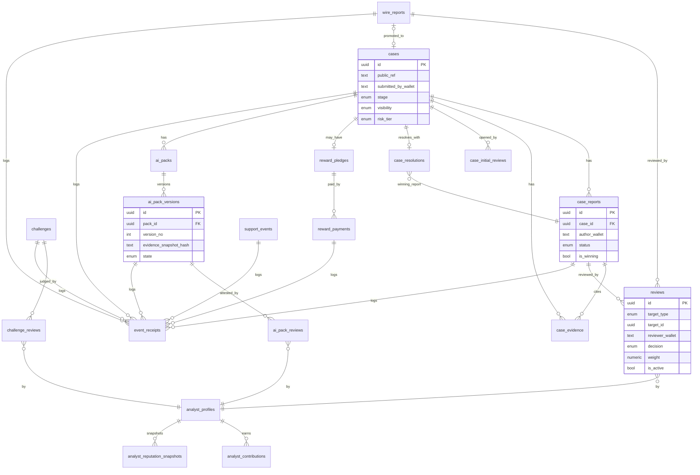

# OSI V2 — Domain Model

**Status:** Blueprint / design-only. No SQL is created or executed by this document. Types below are *proposed*; final DDL is produced only in a later implementation stage after `OSI_V2_OPEN_DECISIONS.md` is resolved.

Conventions: `uuid` PK unless noted; `wallet` = base58 Solana pubkey (text, 32–44); timestamps are `timestamptz`; every table has `created_at` and (where mutable) `updated_at`. **Ownership is proven by wallet signature, never inferred from a stored wallet value** (see §Ownership & proof).

---

## 1. Entity list & consolidation decisions

The task lists 20+ candidate tables. We **consolidate** where a separate table adds no safety or query value, and explain each choice. Final proposed set (17 tables):

| # | Table | Purpose | Consolidation note |
|---|---|---|---|
| 1 | `cases` | first-class Case | new core entity |
| 2 | `case_reports` | Reports attached to a Case | replaces free-text `reports.bounty` link |
| 3 | `wire_reports` | standalone Wire lane | separate lane, no bounties |
| 4 | `case_evidence` | structured evidence refs for a Case/Report | separate from narrative; enables snapshots |
| 5 | `case_initial_reviews` | opens a Case to public investigation | small, distinct lifecycle → own table |
| 6 | `reviews` | **unified** review decisions for case_reports AND wire_reports | *Consolidated:* `report_reviews` + `wire_report_reviews` share identical shape (actor, decision, weight, version); one table with `target_type` avoids duplicated logic and duplicated RLS. Challenge reviews stay separate (different decision set). |
| 7 | `challenges` | disputes against a Report/Case/Pack | reuse existing name |
| 8 | `challenge_reviews` | analyst adjudication of a challenge | distinct decision set (`accept`/`reject`) → own table |
| 9 | `case_resolutions` | chosen winning Report + window | own table (1 active per case) |
| 10 | `analyst_profiles` | identity + current status + cached weight | replaces `analysts` |
| 11 | `analyst_contributions` | append-only per-contribution ledger | drives reputation; immutable rows |
| 12 | `analyst_reputation_snapshots` | periodic frozen weight snapshots | audit + anti-gaming; immutable |
| 13 | `ai_packs` | logical pack (points to current version) | header row |
| 14 | `ai_pack_versions` | immutable versioned content + evidence hash | one row per version |
| 15 | `ai_pack_reviews` | attestations / review decisions on a version | distinct actor rules (self-review ban) |
| 16 | `reward_pledges` | optional reward attached to a Case | separate from payments |
| 17 | `reward_payments` | recorded reward payment attempts/confirmations | separate from support |
| 18 | `support_events` | voluntary support (author/analyst) | **must** be separate from rewards (P7) |
| 19 | `event_receipts` | Proof Log / server-verified receipts | supersedes/absorbs `onchain_events` |
| 20 | `osi_config` | governance config (unchanged) | reuse |

**Consolidations made:** `report_reviews` + `wire_report_reviews` → `reviews` (identical shape). `case_evidence` kept separate from `case_reports` because evidence must be independently hashable/snapshotable for AI Pack staleness. `reward_pledges` vs `reward_payments` vs `support_events` are deliberately **not** merged (constitutional separation of money flows, P7).
**Rejected consolidation:** merging `analyst_contributions` into `analyst_profiles` — rejected because contributions must be append-only/immutable and profiles are mutable; merging would break the anti-gaming audit trail.

---

## 2. Field definitions (proposed)

### `cases`
| field | type | notes |
|---|---|---|
| `id` | uuid PK | server-generated (never client-supplied — closes the current free-text-id XSS/spoof surface) |
| `public_ref` | text unique | short human ref e.g. `OSI-7F3A2C`, derived server-side |
| `title` | text | public-safe, length-capped |
| `category` | enum `case_category` | from Constitution §2 scope allowlist |
| `summary_public` | text | public-safe summary (shown after initial approval) |
| `submitted_by_wallet` | text | **the signer**, set from verified signature at intake |
| `owner_proof_id` | uuid FK→`event_receipts` | receipt of the ownership-binding signature |
| `subject_refs` | jsonb | reported wallets/tokens/urls — **labeled "reported/unverified", never "owner"** |
| `stage` | enum `case_stage` | see state machines |
| `visibility` | enum `visibility` | `private` / `public` |
| `reward_pledge_id` | uuid FK→`reward_pledges` nullable | optional |
| `resolution_id` | uuid FK→`case_resolutions` nullable | set when resolved |
| `sealed_at` | timestamptz nullable | |
| `archived_at` | timestamptz nullable | |
| `risk_tier` | enum `low`/`standard`/`high` | drives quorum thresholds |

Unique: `(public_ref)`. Indexes: `(stage)`, `(visibility, stage)`, `(submitted_by_wallet)`, `(category)`, GIN on `subject_refs`.

### `case_reports`
| field | type | notes |
|---|---|---|
| `id` | uuid PK | server-generated |
| `case_id` | uuid FK→`cases` **NOT NULL** | a Report *must* belong to one Case (Constitution §5) |
| `author_wallet` | text NOT NULL | verified signer |
| `author_proof_id` | uuid FK→`event_receipts` | ownership proof |
| `title` | text | |
| `body_private` | text | private until published |
| `evidence_snapshot_id` | uuid FK→`case_evidence` nullable | |
| `status` | enum `report_status` | pending/published/rejected/… |
| `is_resolution_candidate` | bool | |
| `is_winning` | bool | at most one true per case (partial unique) |

Unique: partial unique `(case_id) WHERE is_winning` (one winner). Indexes: `(case_id, status)`, `(author_wallet)`.

### `wire_reports`
Same shape as `case_reports` **minus** `case_id`, plus `promoted_to_case_id uuid FK→cases nullable` (set when promoted). No reward fields (the Wire hosts no bounties).

### `case_evidence`
| field | type | notes |
|---|---|---|
| `id` | uuid PK | |
| `case_id` | uuid FK→`cases` | |
| `report_id` | uuid FK→`case_reports` nullable | evidence may belong to a report or the case |
| `kind` | enum | `onchain_tx`/`wallet`/`url`/`document`/`token` |
| `ref` | text | e.g. tx sig, wallet, https url (validated) |
| `is_public` | bool | public-safe vs restricted |
| `sha256` | text | content/reference hash for snapshotting |
| `added_by_wallet` | text | |

Index: `(case_id)`, `(report_id)`, `(kind)`.

### `case_initial_reviews`
`id`, `case_id` FK, `reviewer_wallet`, `reviewer_role` (`analyst`/`maintainer`), `decision` (`approve_open`/`reject`/`needs_more`), `reason_code`, `weight` (snapshot at time), `event_receipt_id`. Unique `(case_id, reviewer_wallet)` (one active decision; changes are new rows with `superseded_by`).

### `reviews` (unified case_report + wire_report reviews)
| field | type | notes |
|---|---|---|
| `id` | uuid PK | |
| `target_type` | enum `case_report`/`wire_report` | |
| `target_id` | uuid | FK enforced by trigger/CHECK per type |
| `reviewer_wallet` | text | verified analyst |
| `decision` | enum `approve`/`reject`/`request_revision`/`abstain` | |
| `weight` | numeric(4,2) | snapshot of reviewer weight ∈ [0.50,3.00] |
| `reason_code` | text | structured, no narrative |
| `superseded_by` | uuid nullable | vote changes are **new rows**, old row marked superseded (history, never delete) |
| `is_active` | bool | exactly one active per (target,reviewer) |
| `event_receipt_id` | uuid FK | |

Unique: partial unique `(target_type, target_id, reviewer_wallet) WHERE is_active`. Indexes: `(target_type, target_id, decision, is_active)`.

### `challenges`
`id`, `target_type` (`case`/`case_report`/`wire_report`/`ai_pack_version`/`resolution`), `target_id`, `challenger_wallet`, `reason_code`, `evidence_ref`, `state` (`open`/`under_review`/`accepted`/`rejected`/`withdrawn`/`expired`), `opened_receipt_id`, `resolved_receipt_id`. Index `(target_type, target_id, state)`.

### `challenge_reviews`
`id`, `challenge_id` FK, `reviewer_wallet`, `decision` (`accept`/`reject`), `weight`, `superseded_by`, `is_active`, `event_receipt_id`. Unique partial `(challenge_id, reviewer_wallet) WHERE is_active`.

### `case_resolutions`
`id`, `case_id` FK unique-active, `winning_report_id` FK→`case_reports`, `proposed_by_wallet`, `challenge_window_ends_at`, `state` (`proposed`/`in_challenge_window`/`sealed`/`reopened`), `finalized_by` (`quorum`/`maintainer`/`fallback`), `event_receipt_id`. Partial unique `(case_id) WHERE state <> 'reopened'`.

### `analyst_profiles`
`wallet` PK, `handle`, `display_name`, `bio`, `avatar_url`, `status` (`contributor`/`analyst_candidate`/`probationary_analyst`/`verified_analyst`/`senior_analyst`/`revoked`), `verified` bool, `approved` bool, `weight_cached` numeric(4,2) (cache of latest snapshot, authoritative value lives in snapshots), `verified_by` (maintainer wallet), `verified_receipt_id`. **Source of truth for authorization = `verified AND approved AND status IN (...active...)`, checked server-side.**

### `analyst_contributions` (append-only, immutable)
`id`, `analyst_wallet`, `kind` (`accepted_report`/`winning_report`/`resolved_case`/`challenge_survived`/`challenge_accepted`/`reversal`/`policy_violation`/`peer_agreement`), `subject_type`, `subject_id`, `quality_score` numeric, `signed_by_independent_count` int, `weight_delta_input` numeric, `event_receipt_id`. **No UPDATE/DELETE** (enforced by RLS + trigger). Index `(analyst_wallet, kind)`.

### `analyst_reputation_snapshots` (immutable)
`id`, `analyst_wallet`, `as_of`, `weight` numeric(4,2) ∈ [0.50,3.00], `component_breakdown` jsonb, `algo_version`. Latest per wallet caches into `analyst_profiles.weight_cached`. Immutable.

### `ai_packs` (header)
`id`, `case_id` FK NOT NULL (an AI Pack is **per Case**, resolving the current `case_ref=report_id` ambiguity), `current_version_id` FK→`ai_pack_versions` nullable, `pack_type` (`victim`/`exchange`/`law_enforcement`), `overall_state` (mirrors current version state). Unique `(case_id, pack_type)`.

### `ai_pack_versions` (immutable)
`id`, `pack_id` FK, `version_no` int, `evidence_snapshot_hash` text (sha256 over the ordered public evidence set), `content_restricted` text, `content_public_brief` text, `model` text, `created_by_wallet`, `created_by_role`, `state` (`draft`/`review_required`/`supported`/`disputed`/`approved`/`attached_to_resolution`/`superseded`/`stale`), `confidence_profile` jsonb, `event_receipt_id`. Unique `(pack_id, version_no)`. **Immutable after insert** except `state` transitions via controlled function.

### `ai_pack_reviews`
`id`, `version_id` FK, `reviewer_wallet`, `reviewer_role`, `decision` (`support`/`dispute`/`request_revision`/`approve`), `weight`, `superseded_by`, `is_active`, `event_receipt_id`. **A reviewer may not review a version they created** (enforced server-side). Partial unique `(version_id, reviewer_wallet) WHERE is_active`.

### `reward_pledges`
`id`, `case_id` FK unique, `pledger_wallet`, `amount_lamports` bigint, `token` (`SOL`), `state` (`pledged`/`assigned`/`paid`/`cancelled`/`expired`), `winning_report_id` FK nullable, `created_receipt_id`. **No custody** — this row records intent, never holds funds.

### `reward_payments`
`id`, `pledge_id` FK, `from_wallet`, `to_wallet` (winning author), `amount_lamports`, `tx_sig` text, `state` (`initiated`/`submitted`/`confirmed`/`failed`/`timed_out`), `confirmed_at`, `event_receipt_id`. `tx_sig` recorded only after **RPC confirmation** (mirrors current Stage 4 support behavior).

### `support_events`
`id`, `support_type` (`report_author`/`analyst`), `target_wallet`, `from_wallet`, `amount_lamports`, `token`, `tx_sig`, `state` (`submitted`/`confirmed`/`failed`), `event_receipt_id`. **Never referenced by any reputation/consensus query** (P7).

### `event_receipts` (Proof Log; supersedes `onchain_events`)
`id`, `event_version` (`OSI2`), `event_type` text, `target_type`, `target_id`, `actor_wallet`, `actor_role`, `decision` text nullable, `memo_ref` text nullable, `payload_hash` text, `nonce` text, `tx_sig` text nullable, `signature` text nullable (for signMessage-only events), `server_verified` bool (future Stage-5 field, default false), `occurred_at`. **In V2 the write path is a server-side receipt endpoint, not an anon insert** (closes the current anon-writable Proof Log integrity gap). Index `(target_type, target_id)`, `(actor_wallet)`, `(event_type)`.

---

## 3. Ownership & proof model

- **`submitted_by_wallet` / `author_wallet`** are set **server-side from a verified ed25519 signature** at intake, never from a client field.
- Each creation emits an **ownership receipt** (`event_receipts` row) binding wallet + purpose + payload hash + nonce + timestamp.
- Owner status views ("My Cases/Reports") authorize via a **fresh wallet-signature proof** (same scheme as `osi-analyst-intake`, new purpose strings), returning only rows where `submitted_by_wallet/author_wallet == proven wallet`. Never a broad public RLS SELECT on pending rows.
- **`subject_refs`** (reported wallets) are always labeled *reported/unverified* and are **never** an ownership or authorization signal (this is the current `reports.wallet`/`WALLET_ON_RECORD` lesson made structural).

## 4. Public / private classification

| Data | Private (pre-initial-approval) | Public (post-initial-approval) |
|---|---|---|
| Case title/category/public summary | owner+analyst+maintainer | public |
| Report bodies | author+analyst+maintainer | published reports public; pending stay private |
| Evidence `is_public=false` | authorized only | still restricted |
| Review decisions | analyst+maintainer | **totals + public attestations** public; private reason codes restricted |
| AI Pack restricted content | authorized only | never public |
| AI Pack public brief | — | public after approval |
| Reward pledge amount | owner+analyst | public after case opens |
| Proof Log receipts | minimal refs | public (minimal refs only) |

## 5. Source-of-truth rules

- **Authorization truth** = server (Edge Function verifying signature + `analyst_profiles`/maintainer) and **RLS**. Never client role state.
- **Reputation truth** = latest `analyst_reputation_snapshots` row (profiles cache is advisory).
- **Case lifecycle truth** = `cases.stage` + related governance tables; UI labels are derived, never authoritative.
- **Payment truth** = `reward_payments.state='confirmed'` with a real `tx_sig`; a Proof Log row alone is **not** proof of a confirmed transaction.
- **AI Pack currency truth** = `ai_packs.current_version_id`; a version is `stale` if `evidence_snapshot_hash` ≠ current evidence hash.

## 6. Mermaid ER diagram

## 7. Key constraints summary

- `case_reports.case_id` NOT NULL (Report ⟶ exactly one Case).
- Partial unique winner per case; partial unique active review per (target, reviewer); partial unique active challenge review.
- Immutable tables: `analyst_contributions`, `analyst_reputation_snapshots`, `ai_pack_versions` (content), `event_receipts` — enforced by RLS (no anon/user UPDATE/DELETE) + DB triggers.
- All ids server-generated (no client-supplied text ids → removes the current spoofable-id class).
- Self-review prohibitions enforced server-side, not by unique constraints alone.
