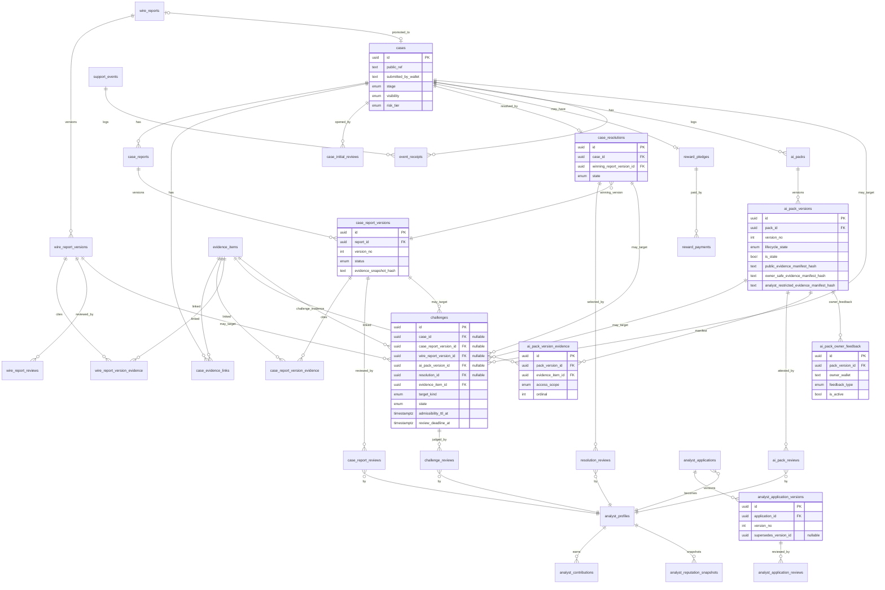

# OSI V2 — Domain Model

**Status:** Blueprint / design-only. No SQL is created or executed by this document. Types below are *proposed*; final DDL is produced only after `OSI_V2_OPEN_DECISIONS.md` is signed off and the Stage-5 write-gate work is complete.

**Authoritative table count: 32** (this number is identical in `OSI_V2_README.md`, `OSI_V2_STATE_MACHINES.md`, `OSI_V2_MIGRATION_ROLLOUT_PLAN.md`, `OSI_V2_CURRENT_MAPPING_APPENDIX.md`, `OSI_V2_AI_PACK_TRUST_MODEL.md`, and the final report). Every one of the 32 is fully defined in this document — the blueprint models **every persistent action before SQL design begins**; no required entity is deferred "to implementation."

Conventions: `uuid` PK, **server-generated** (no client-supplied ids); `wallet` = base58 Solana pubkey; timestamps `timestamptz`; every table has `created_at`, mutable tables add `updated_at`. **Ownership is proven by wallet signature, never inferred from a stored wallet value.**

---

## 1. Authoritative entity list (32)

| Group | Tables |
|---|---|
| Case & Report headers/versions (5) | `cases`, `case_reports`, `case_report_versions`, `wire_reports`, `wire_report_versions` |
| Evidence & Pack evidence manifests (5) | `evidence_items`, `case_evidence_links`, `case_report_version_evidence`, `wire_report_version_evidence`, `ai_pack_version_evidence` |
| Governance review tables — typed, real FKs (7) | `case_initial_reviews`, `case_report_reviews`, `wire_report_reviews`, `resolution_reviews`, `challenge_reviews`, `ai_pack_reviews`, `analyst_application_reviews` |
| Resolution & challenge (2) | `case_resolutions`, `challenges` |
| Analyst (5) | `analyst_applications`, `analyst_application_versions`, `analyst_profiles`, `analyst_contributions`, `analyst_reputation_snapshots` |
| AI Pack (3) | `ai_packs`, `ai_pack_versions`, `ai_pack_owner_feedback` |
| Money (3) | `reward_pledges`, `reward_payments`, `support_events` |
| Proof & config (2) | `event_receipts`, `osi_config` |

Total = 5 + 5 + 7 + 2 + 5 + 3 + 3 + 2 = **32**. Three tables were promoted from prose to first-class entities in this revision: `analyst_application_versions` (immutable application content), `ai_pack_owner_feedback` (advisory, uncounted owner feedback), and `ai_pack_version_evidence` (per-layer evidence manifest).

### 1.1 Typed reviews vs polymorphic timeline (design decision)
The first release uses **seven typed, FK-backed review tables** — one per governance decision type — instead of a single polymorphic `reviews(target_type,target_id)` table. Rationale: each governance-critical decision row gets a **real foreign key** to its exact target (a `case_report_versions.id`, a `case_resolutions.id`, etc.), so referential integrity and cascade behavior are enforced by the database, not by triggers. The tables share a **common column contract** (§3.0) for consistent tooling, but never merge. **`event_receipts` remains target-polymorphic** because it is a timeline/receipt store, not the authoritative decision store — the typed review row is the source of truth; the receipt is its provenance record.

### 1.2 Consolidations kept / rejected
- **Kept separate:** the three money tables (`reward_pledges`, `reward_payments`, `support_events`) — constitutional separation (P7). `evidence_items` (immutable content) vs the three link tables — enables independent hashing/snapshotting for Case, Report versions, and Wire Report versions.
- **Rejected merges:** report+wire reviews into one table (breaks real FKs, §1.1); `analyst_contributions` into `analyst_profiles` (contributions are immutable, profiles mutable); versions into headers (headers are mutable pointers, versions are immutable content).

---

## 2. Report / Wire versioning model

A **header** row is the logical, mutable pointer; **version** rows are immutable content. Review decisions, publication, winning selection, challenges, AI Pack source binding, and Proof Log entries all target an **exact version id**, never the header alone. A published version can never be silently edited — a revision creates a new version.

- `case_reports` (header) → many `case_report_versions` (immutable).
- `wire_reports` (header) → many `wire_report_versions` (immutable).
- `case_reports.current_version_id` / `wire_reports.current_version_id` = derived pointer to the latest **submitted** version (advisory; the authoritative content is the version row).
- `case_reports.current_published_version_id` / `wire_reports.current_published_version_id` = the version currently shown as the public one (correction #4). **It is not "set once" and it is not a freely mutable client field** — it advances **only** through a controlled, quorum-authorized publication transition (`OSI_V2_STATE_MACHINES.md §3/§4`). Publishing a corrected version repoints it forward but **never deletes or rewrites** the prior published version.

**Publishing a corrected version (correction #4):**
- does not delete or rewrite the old published version;
- makes the new version the current public version (`current_published_version_id` advances);
- preserves the old public history in the Proof Log + version rows (`published_at`, `superseded_at`, `superseded_by_version_id`, publication receipt all retained);
- **does not silently redirect an existing resolution to a different version** — a `case_resolutions` row stays permanently bound to the exact `winning_report_version_id` that was selected, even after a newer version is published.

---

## 3. Field definitions (proposed)

### 3.0 Common review-row contract (shared by all 7 typed review tables)
Every typed review table has: `id uuid PK`, a **typed FK** to its target (named per table), `reviewer_wallet text`, `decision <enum per table>`, `weight numeric(4,2)` (reviewer weight snapshot ∈ [0.50,3.00] at decision time), `reason_code text` (structured, no narrative), `is_active bool`, `superseded_by uuid nullable` (self-FK), `event_receipt_id uuid FK→event_receipts`, `created_at`. **History rule:** a changed decision inserts a **new** row and sets the prior row's `superseded_by` + `is_active=false`; rows are never deleted. **Active constraint:** partial unique on `(<target_fk>, reviewer_wallet) WHERE is_active`.

### `cases`
| field | type | notes |
|---|---|---|
| `id` | uuid PK | server-generated |
| `public_ref` | text unique | short ref `OSI-7F3A2C`, server-derived |
| `title` | text | public-safe |
| `category` | enum `case_category` | Constitution §2 allowlist |
| `summary_public` | text | shown after open |
| `submitted_by_wallet` | text | set from verified signature at intake |
| `stage` | enum `case_stage` | see state machines |
| `visibility` | enum `visibility` | `private`/`public` |
| `risk_tier` | enum `low`/`standard`/`high` | drives thresholds (§ risk-tier rules) |
| `subject_refs` | jsonb | reported wallets/tokens/urls — **labeled reported/unverified, never owner** |
| `sealed_at`, `archived_at` | timestamptz nullable | |

**No `reward_pledge_id`, no `resolution_id`** on `cases` (single-source-of-truth, §5). The reward and resolution point *to* the case. Indexes: `(stage)`, `(visibility,stage)`, `(submitted_by_wallet)`, `(category)`, `(risk_tier)`, GIN `(subject_refs)`.

### `case_reports` (header)
`id`, `case_id uuid FK→cases NOT NULL` (a Report belongs to exactly one Case), `author_wallet`, `current_version_id uuid nullable` (latest submitted version), `current_published_version_id uuid nullable` (**advances only via the quorum-authorized publication transition; never set-once, never client-writable** — correction #4), `status enum report_status`. **No `is_winning`** (winner is authoritative in `case_resolutions`, §5). Index `(case_id,status)`, `(author_wallet)`.

### `case_report_versions` (immutable)
`id`, `report_id uuid FK→case_reports`, `version_no int`, `created_by_wallet`, `body_private text`, `content_public_safe text nullable`, `evidence_snapshot_hash text`, `supersedes_version_id uuid nullable` (predecessor), `superseded_by_version_id uuid nullable` (successor once a corrected version publishes), `revision_reason_code text nullable`, `lifecycle_state enum version_status` (`draft`/`submitted`/`in_review`/`published`/`rejected`/`revision_requested`/`superseded`), `published_at timestamptz nullable`, `superseded_at timestamptz nullable`, `publication_receipt_id uuid FK→event_receipts nullable`, `event_receipt_id`. Unique `(report_id, version_no)`. **Immutable content** except controlled lifecycle-state transitions and the append-only `superseded_by_version_id`/`superseded_at` set when a later version publishes. Full publication history (who published which version, when, and its receipt) is retained per version — republication never erases it (correction #4).

### `wire_reports` (header) / `wire_report_versions` (immutable)
Same shape as `case_reports`/`case_report_versions` minus `case_id`; `wire_reports` adds `promoted_to_case_id uuid FK→cases nullable` and carries the same `current_version_id` / `current_published_version_id` pointer model (correction #4). `wire_report_versions` carries the same `published_at`/`superseded_at`/`superseded_by_version_id`/`publication_receipt_id` publication-history fields. No reward fields.

### `evidence_items` (immutable)
`id`, `kind enum` (`onchain_tx`/`wallet`/`url`/`document`/`token`), `ref text` (validated: tx sig / wallet / https url), `is_public bool`, `sha256 text` (content/reference hash), `added_by_wallet`. **Immutable.** One canonical evidence row; reused via link tables. Index `(kind)`, `(sha256)`.

### `case_evidence_links` / `case_report_version_evidence` / `wire_report_version_evidence`
Join tables binding an `evidence_items.id` to (respectively) a `cases.id`, a `case_report_versions.id`, or a `wire_report_versions.id`, each with `added_by_wallet`, `created_at`. Real FKs both sides. AI Pack versions reference an **ordered evidence set hash** computed over the relevant links (see `ai_pack_versions.evidence_snapshot_hash`). This models **Wire evidence as first-class**, not a UI concept.

### `case_initial_reviews`  *(typed review; contract §3.0)*
FK: `case_id uuid FK→cases`. `decision enum` (`approve_open`/`reject`/`needs_more`). Opens a Case (approve) or normal-rejects it (see safety-block split, State Machines §1). Partial unique `(case_id, reviewer_wallet) WHERE is_active`.

### `case_report_reviews`  *(typed)*
FK: `report_version_id uuid FK→case_report_versions`. `decision enum` (`approve`/`reject`/`request_revision`/`abstain`). Targets an **exact version**. Author excluded server-side.

### `wire_report_reviews`  *(typed)*
FK: `wire_report_version_id uuid FK→wire_report_versions`. Same decision enum.

### `resolution_reviews`  *(typed — new, correction #1)*
FK: `resolution_id uuid FK→case_resolutions`, plus `winning_report_version_id uuid FK→case_report_versions` (binds to the exact proposed winning version). `decision enum` (`select`/`object`/`abstain`). Proves which analysts selected the winner, each weight snapshot, count+weight gates met, author/owner exclusion, and full history.

### `challenge_reviews`  *(typed)*
FK: `challenge_id uuid FK→challenges`. `decision enum` (`accept`/`reject`). Distinct from admissibility (which is a challenge state transition, §challenges).

### `ai_pack_reviews`  *(typed)*
FK: `pack_version_id uuid FK→ai_pack_versions`. `decision enum` (`support`/`dispute`/`request_revision`/`approve`). Reviewer ≠ version creator (server-enforced). **Case-owner feedback is NOT stored here** — see `ai_pack_owner_feedback` note below.

### `analyst_application_reviews`  *(typed)*
FK: `application_version_id uuid FK→analyst_application_versions` (targets an **exact immutable application version**, not merely the header — correction #2). `decision enum` (`approve`/`reject`/`request_revision`). Partial unique `(application_version_id, reviewer_wallet) WHERE is_active`.

### `case_resolutions`
`id`, `case_id uuid FK→cases` (partial unique active), `winning_report_version_id uuid FK→case_report_versions` (authoritative winner — **exact version, bound permanently; a later published correction of the same Report never re-points a finalized resolution**, correction #4), `proposed_by_wallet`, `challenge_window_ends_at timestamptz`, `state enum` (`proposed`/`in_challenge_window`/`sealed`/`reopened`/`resolved_legacy`), `finalized_by enum` (`quorum_maintainer`/`fallback`), `event_receipt_id`. `resolved_legacy` is used only by migration (D2). Partial unique `(case_id) WHERE state <> 'reopened'`.

### `challenges`  *(typed FK targets, correction #5)*
Governance-critical challenge targets are **real foreign keys**, not an untyped `target_type`+`target_id` pair. Columns:
- `id uuid PK`, `challenger_wallet`, `reason_code`.
- **Typed nullable target FKs (exactly one non-null):** `case_id uuid FK→cases nullable`, `case_report_version_id uuid FK→case_report_versions nullable`, `wire_report_version_id uuid FK→wire_report_versions nullable`, `ai_pack_version_id uuid FK→ai_pack_versions nullable`, `resolution_id uuid FK→case_resolutions nullable`. **CHECK: exactly one of the five target FKs is non-null.**
- `target_kind enum` (`case`/`case_report_version`/`wire_report_version`/`ai_pack_version`/`resolution`) — **derived/stored with a consistency CHECK against which FK is set; it never replaces the real FK.**
- **Evidence FK (not a raw URL):** `evidence_item_id uuid FK→evidence_items NOT NULL`. An external URL must first be inserted as a validated `evidence_items` row (`kind='url'`); the challenge row has **no untyped evidence-URL alternative** (correction #5).
- `state enum` (`submitted`/`admissibility_review`/`open`/`under_review`/`accepted`/`rejected`/`withdrawn`/`expired`), `admitted_by_wallet nullable`.
- **Lifecycle TTL / no-stuck-state fields (correction #6):** `admissibility_ttl_at timestamptz` (deadline for `submitted`/`admissibility_review`), `review_deadline_at timestamptz nullable` (configurable deadline/escalation for `open`/`under_review`), `expired_reason enum nullable` (`admissibility_timeout`/`review_timeout`).
- `cooldown_key text` (rate limiting), `bad_faith_flag bool default false` (**set only by an explicit separate bad-faith determination, never automatically**), `opened_receipt_id`, `resolved_receipt_id`.

**Only `open`/`under_review` pause sealing.** Submission and inadmissible challenges never pause sealing. Every non-terminal state has a TTL or explicit next action (§ State Machines §5). Partial unique: one active challenge per `(challenger_wallet, target_kind, <the set target FK>) WHERE state IN (submitted,admissibility_review,open,under_review)`. `event_receipts` for challenges stay polymorphic (provenance timeline, not the authoritative target store). Index `(target_kind,state)`, `(state,admissibility_ttl_at)`, `(state,review_deadline_at)`.

### `analyst_applications`  *(header/lifecycle, correction #2/#8)*
`id`, `applicant_wallet`, `origin enum` (`path_a_direct`/`path_b_derived`), `status enum` (`submitted`/`in_review`/`revision_requested`/`approved`/`rejected`/`withdrawn`), `current_version_id uuid FK→analyst_application_versions nullable` (pointer to latest submitted version), `event_receipt_id`. **The header holds lifecycle only; submitted content lives in immutable `analyst_application_versions`.** Reviews live in `analyst_application_reviews` and target an exact application version. `analyst_profiles` is created/updated only on the relevant lifecycle transition — **never** an application shortcut. Index `(applicant_wallet,status)`.

### `analyst_application_versions`  *(new — immutable application content, correction #2)*
`id`, `application_id uuid FK→analyst_applications`, `version_no int`, `expertise_public jsonb` (public-safe), `details_restricted jsonb` (restricted), `created_by_wallet`, `supersedes_version_id uuid nullable` (predecessor), `revision_reason_code text nullable`, `submitted_at timestamptz`, `event_receipt_id`. Unique `(application_id, version_no)`. **Immutable.** A revision creates a **new** version; prior application contents and their reviews remain available for audit. Reviews FK to `analyst_application_versions.id`, never to the header.

### `analyst_profiles`
`wallet PK`, `handle`, `display_name`, `bio`, `avatar_url`, `status enum` (`contributor`/`analyst_candidate`/`probationary_analyst`/`verified_analyst`/`senior_analyst`/`revoked`), `verified bool`, `approved bool`, `weight_cached numeric(4,2)` (cache of latest snapshot; authoritative value in snapshots), `verified_by`, `verified_receipt_id`. Authorization truth = `verified AND approved AND status active`, checked server-side.

### `analyst_contributions` (append-only, immutable)
`id`, `analyst_wallet`, `kind enum`, `subject_type`, `subject_id`, `quality_score numeric`, `signed_by_independent_count int`, `weight_delta_input numeric`, `event_receipt_id`. No UPDATE/DELETE (RLS + trigger). Index `(analyst_wallet,kind)`.

### `analyst_reputation_snapshots` (immutable)
`id`, `analyst_wallet`, `as_of`, `weight numeric(4,2)` ∈ [0.50,3.00], `component_breakdown jsonb`, `algo_version`. Immutable. Latest caches to `analyst_profiles.weight_cached`.

### `ai_packs` (header)
`id`, `case_id uuid FK→cases NOT NULL` (AI Pack is **per Case**), `pack_type enum` (`victim`/`exchange`/`law_enforcement`), `current_version_id uuid nullable`. Unique `(case_id,pack_type)`. No standalone lifecycle field — currency is derived from the current version (§ correction #11). Uncounted owner feedback lives in the first-class `ai_pack_owner_feedback` table (below), never in `ai_pack_reviews`.

### `ai_pack_versions` (immutable content; controlled state)
`id`, `pack_id uuid FK→ai_packs`, `version_no int`, **three evidence-manifest hashes (correction #8):** `public_evidence_manifest_hash text` (sha256 over the ordered `ai_pack_version_evidence` rows with `access_scope='public'`), `owner_safe_evidence_manifest_hash text` (over `public`+`owner_safe`), `analyst_restricted_evidence_manifest_hash text` (over the allowed restricted scopes), `content_public_brief text`, `content_owner_safe text`, `content_analyst_restricted text`, `model text`, `created_by_wallet`, `created_by_role`, `lifecycle_state enum` (`draft`/`review_required`/`revision_requested`/`supported`/`disputed`/`approved`/`rejected`/`attached_to_resolution`/`superseded`), `is_stale bool default false`, `stale_at timestamptz nullable`, `stale_reason text nullable`, `superseded_by_version_id uuid nullable`, `confidence_profile jsonb`, `event_receipt_id`. Unique `(pack_id,version_no)`. Each content layer is generated **only** from evidence at its allowed scope, and staleness is checked **per layer** against that layer's manifest hash (correction #8). **Staleness is orthogonal** to lifecycle (correction #11): an `approved`/`attached_to_resolution` version may become `is_stale=true` while its historical lifecycle remains visible. Three content layers (correction #12).

### `ai_pack_owner_feedback`  *(new — advisory, uncounted, correction #1)*
`id`, `pack_version_id uuid FK→ai_pack_versions`, `owner_wallet`, `feedback_type enum` (`correction_request`/`clarification`/`evidence_note`), `public_safe_summary text nullable`, `feedback_restricted text nullable`, `is_active bool default true`, `superseded_by uuid nullable` (self-FK; a revised note supersedes the prior), `event_receipt_id`, `created_at`. **Rules (all server-enforced):** only the **proven Case owner** of the pack's Case may insert; it is **advisory only**; it contributes **zero** voting weight; it **never** appears in `ai_pack_reviews`; it **never** changes the Evidence Confidence Profile automatically; it **never** approves or rejects a Pack. `feedback_restricted` stays restricted (owner+analyst+maintainer). Canonical event `AI_PACK_OWNER_FEEDBACK_SUBMITTED` (class B). Partial unique `(pack_version_id, owner_wallet) WHERE is_active` (one active note per owner per version; revisions supersede).

### `ai_pack_version_evidence`  *(new — immutable per-layer manifest, correction #8)*
`id`, `pack_version_id uuid FK→ai_pack_versions`, `evidence_item_id uuid FK→evidence_items`, `access_scope enum` (`public`/`owner_safe`/`analyst_restricted`), `ordinal int` (manifest order), `evidence_hash_at_generation text` (the evidence item's hash captured at generation), `created_at`. **Immutable for an existing pack version.** Unique `(pack_version_id, evidence_item_id)`; index `(pack_version_id, access_scope, ordinal)`. This is the authoritative record of **which evidence items and hashes produced each output layer**: the public brief may use only `public` rows; owner-safe may use `public`+`owner_safe`; analyst-restricted may use its allowed scopes but **never** secrets, keys, illegal-access data, or highly sensitive personal information. The three `*_manifest_hash` fields on `ai_pack_versions` are computed from these rows, making each version reproducible without exposing restricted evidence publicly.

### `reward_pledges`
`id`, `case_id uuid FK→cases` unique, `pledger_wallet`, `amount_lamports bigint`, `token`, `state enum` (`pledged`/`assigned`/`paid`/`cancelled`/`expired`), `winning_report_version_id uuid FK nullable`, `created_receipt_id`. Records intent; **no custody**.

### `reward_payments`
`id`, `pledge_id uuid FK`, `from_wallet`, `to_wallet`, `amount_lamports`, `tx_sig text`, `state enum` (`initiated`/`submitted`/`confirmed`/`failed`/`timed_out`), `confirmed_at`, `event_receipt_id`. `tx_sig`/`confirmed` set only after RPC confirmation.

### `support_events`
`id`, `support_type enum` (`report_author`/`analyst`), `target_wallet`, `from_wallet`, `amount_lamports`, `token`, `tx_sig`, `state enum` (`submitted`/`confirmed`/`failed`), `event_receipt_id`. **Never referenced by any reputation/consensus/ranking/discovery query** (P7, correction #15).

### `event_receipts` (Proof Log; supersedes `onchain_events`)
`id`, `event_version enum` (`OSI2`/`OSI1`/`legacy`), `event_type text`, `target_type`, `target_id`, `actor_wallet`, `actor_role`, `decision text nullable`, `proof_type enum` (`solana_memo`/`wallet_signed_server_verified`/`system_event`/`legacy_imported`), `memo_ref text nullable`, `payload_hash text`, `nonce text`, `tx_sig text nullable`, `signature text nullable`, `server_verified bool`, `occurred_at`. **Native V2 receipts are inserted only by the server-only receipt path with `server_verified=true`; imported V1/legacy rows are `server_verified=false`.** Public projection exposes only minimal refs. Index `(target_type,target_id)`, `(actor_wallet)`, `(event_type)`, `(proof_type)`.

### `osi_config`
Governance config (reused). Keys include thresholds, feature flags (`OSI_V2_WRITES_ENABLED`, `OSI_V2_FALLBACK_GOVERNANCE`), cooldowns, challenge windows.

---

## 4. Ownership & proof model
- `submitted_by_wallet` / `author_wallet` / `created_by_wallet` are set **server-side from a verified ed25519 `signMessage`** at intake (never a client field).
- Each creation and each individual analyst decision emits a **server-verified receipt** (nonce + purpose + exact target id/version + payload hash + freshness) — the hybrid signature model (D15).
- Owner status reads authorize via a fresh signature proof (purpose `OWNER_STATUS_PROOF`), returning only rows where the ownership wallet matches. No broad public RLS on private rows (D6).
- `subject_refs` (reported wallets) are always *reported/unverified* and never an authorization signal.

## 5. Single source of truth (correction #10)
Authoritative relation directions (the child points to the parent); the parent does **not** hold a writable back-pointer:

| Relation | Authoritative source | Removed redundant field |
|---|---|---|
| Case ↔ reward pledge | `reward_pledges.case_id` | ~~`cases.reward_pledge_id`~~ |
| Case ↔ resolution | `case_resolutions.case_id` | ~~`cases.resolution_id`~~ |
| Case ↔ winning report | `case_resolutions.winning_report_version_id` | ~~`case_reports.is_winning`~~ |
| Report ↔ current public version | `case_reports.current_published_version_id` (advances only via the quorum publication transition; each version keeps its own `published_at`/`superseded_at`) | ~~`published_version_id` "set once"~~ |
| Resolution ↔ winning version | `case_resolutions.winning_report_version_id` (permanently bound to the exact selected version) | — |
| Pack currency | `ai_packs.current_version_id` | no separate `overall_state` |
| Pack layer evidence | `ai_pack_version_evidence` (+ derived `*_manifest_hash`) | — |
| Owner Pack feedback | `ai_pack_owner_feedback` (advisory, uncounted) | never in `ai_pack_reviews` |

Derived read-only **views** may expose convenience fields (e.g. `case_current_reward_v`), but they are never independently writable.

## 6. Public / private classification

| Data | Private (pre-open) | Public (post-open) |
|---|---|---|
| Case title/category/public summary | owner+analyst+maintainer | public |
| Report version bodies | author+analyst+maintainer | published versions public; pending private |
| Evidence `is_public=false` | authorized only | still restricted |
| Review decisions | analyst+maintainer | **public analyst attribution** (identity, decision, weight snapshot, timestamp, proof type) — correction #14; private reason codes restricted |
| AI Pack `content_analyst_restricted` | analyst+maintainer | never public |
| AI Pack `content_owner_safe` | owner (+analyst+maintainer) | not public |
| AI Pack `content_public_brief` | — | public after approval |
| Reward pledge | owner+analyst | public after open |
| Proof Log receipts | minimal refs | public (minimal refs) |

## 7. Mermaid ER diagram

## 8. Source-of-truth rules
- **Authorization** = server (signature + `analyst_profiles`/maintainer) + RLS. Never client state.
- **Reputation** = latest `analyst_reputation_snapshots`; profile cache advisory.
- **Case lifecycle** = `cases.stage` + governance tables.
- **Report public content** = `case_reports.current_published_version_id` (advances only via the quorum publication transition; prior published versions stay auditable via their own `published_at`/`superseded_at`).
- **Winner** = `case_resolutions.winning_report_version_id` (permanently bound to the exact selected version, independent of later republication).
- **AI Pack layer provenance** = `ai_pack_version_evidence` per `access_scope` + the derived `*_manifest_hash` on the version; staleness is checked per layer.
- **Payment** = `reward_payments.state='confirmed'` with real `tx_sig`; a receipt alone is not payment proof.
- **AI Pack currency** = `ai_packs.current_version_id` + version `is_stale`.
- **Proof authenticity** = `event_receipts.server_verified=true` (native V2) vs `false` (legacy import).
