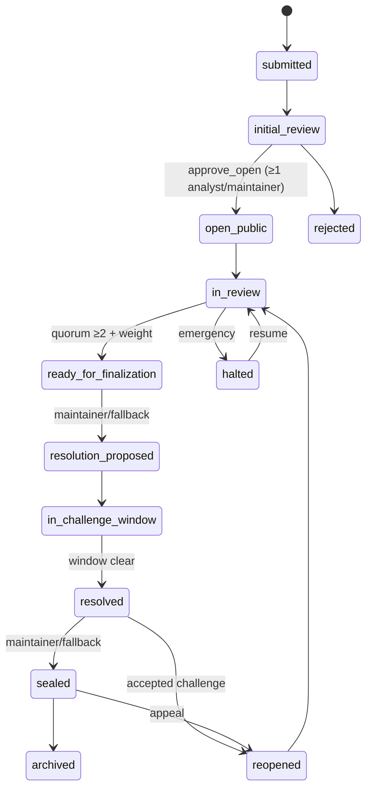
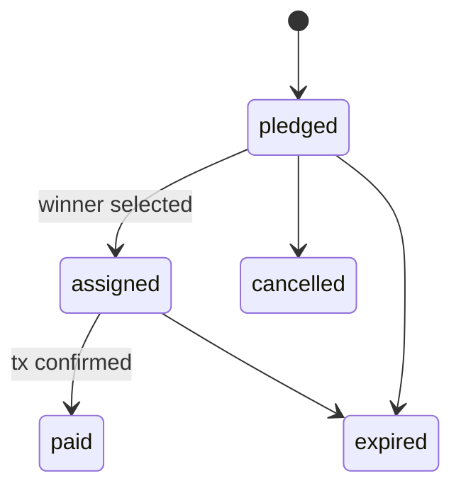

# OSI V2 — State Machines

**Status:** Blueprint / design-only. Thresholds reference `OSI_V2_VOTING_REPUTATION_MODEL.md`. Every transition names an actor, a server enforcement point, the required independent-analyst count, the weighted threshold, the memo/event, the DB mutation, the public-visibility effect, and reversal rules.

Global rules:
- **Independent analysts** = distinct `analyst_wallet`s that are not the contribution's author/owner and are not colluding per anti-gaming checks.
- **No self-decisive authority (P3):** the author/owner is excluded from any count that decides their own item.
- **Critical outcomes** (publish, reject-final, resolve, pack-approve, seal) require **≥ 2 independent analysts** *and* a weighted threshold *and* (normal path) maintainer finalization.
- Every transition emits an `event_receipts` row (see `OSI_V2_MEMO_EVENT_SPEC.md`). "Memo" column = whether a Solana memo tx is required vs signMessage-only vs server-receipt-only.

---

## 1. Case

States: `draft → submitted → initial_review → open_public → in_review → ready_for_finalization → resolution_proposed → in_challenge_window → resolved → sealed → archived`; side states `rejected`, `reopened`, `halted`.

| From → To | Actor | Server enforcement | Indep. analysts | Weight thr. | Memo/event | DB mutation | Public effect | Reversal |
|---|---|---|---|---|---|---|---|---|
| draft→submitted | owner | Edge Fn verify sig | – | – | signMessage + receipt `CASE_SUBMITTED` | insert `cases{stage:submitted,visibility:private}` | none (private) | owner may withdraw→`rejected` |
| submitted→initial_review | system | Edge Fn (queue) | – | – | server receipt | stage=initial_review | none | – |
| initial_review→open_public | 1 analyst **or** maintainer `approve_open` | Edge Fn verify analyst/maintainer | 1 (opens only) | ≥0.50 | memo `CASE_OPENED` | insert `case_initial_reviews`; stage=open_public; visibility=public | Case becomes publicly visible (stage/summary/counts) | maintainer/quorum can re-close→`halted` |
| initial_review→rejected | 1 analyst+maintainer or maintainer | Edge Fn | 1 | – | receipt `CASE_INITIAL_REJECTED` (reason_code only) | stage=rejected | stays private | appeal→reopen |
| open_public→in_review | system | – | – | – | server receipt | stage=in_review when ≥1 report under review | public | – |
| in_review→ready_for_finalization | quorum | Edge Fn tally | ≥2 | ≥ risk_tier threshold | receipt `CASE_QUORUM_READY` | stage=ready_for_finalization | public shows "ready" | quorum loss→back to in_review |
| ready_for_finalization→resolution_proposed | maintainer (normal) OR fallback | Edge Fn maintainer auth OR fallback rule | ≥2 (+maintainer) | ≥ thr | memo `RESOLUTION_PROPOSED` | insert `case_resolutions`; stage=resolution_proposed | winning report shown | maintainer can reject proposal |
| resolution_proposed→in_challenge_window | system | – | – | – | receipt | resolution.state=in_challenge_window; `challenge_window_ends_at=now+7d` | 7-day window public | – |
| in_challenge_window→resolved | system (window elapsed, no active challenge) | Edge Fn checks no `challenges.state IN(open,under_review)` | – | – | memo `CASE_RESOLVED` | stage=resolved | resolved public | reopen via accepted challenge/appeal |
| resolved→sealed | maintainer (normal) OR fallback+waiting | Edge Fn | ≥2 (+maintainer) | ≥ thr | memo `RECORD_SEALED` | cases.sealed_at | "Sealed" badge | reopen (appeal) |
| sealed→archived | system (retention) | – | – | – | receipt | archived_at | archived | reopen |
| any→halted | maintainer emergency OR fallback security rule | Edge Fn | – | – | memo `CASE_HALTED` | stage=halted | frozen, banner | resume by maintainer/quorum |
| resolved/sealed→reopened | accepted challenge OR appeal quorum | Edge Fn | ≥2 | ≥ high thr | memo `CASE_REOPENED` | stage=reopened→in_review | reopened public | – |

## 2. Case initial review
States: `pending → approve_open | reject | needs_more`. Actor: analyst or maintainer. One active decision per (case, reviewer); a changed decision inserts a new row and sets `superseded_by`. Opening requires only 1 approval (low bar — it means "public-safe to investigate," not "true"). Event: memo `CASE_OPENED` on the first approve_open only.

## 3. Case Report
States: `draft → submitted → in_review → (published | rejected | revision_requested) → [winning] → immutable`.

| From→To | Actor | Enforce | Indep. | Weight | Memo/event | Mutation | Public | Reversal |
|---|---|---|---|---|---|---|---|---|
| draft→submitted | author | Edge Fn sig | – | – | signMessage `REPORT_SUBMITTED` | insert `case_reports{status:pending}` | private | withdraw |
| submitted→in_review | system | – | – | – | receipt | status=in_review | private | – |
| in_review→published | quorum (author excluded) | Edge Fn tally, **author≠reviewer** | ≥2 | ≥ thr | memo `REPORT_PUBLISHED` | status=published | report body public | unpublish (maintainer/quorum) |
| in_review→rejected | quorum | Edge Fn | ≥2 | ≥ thr | receipt `REPORT_REJECTED` (reason_code) | status=rejected | stays private | revision→resubmit |
| in_review→revision_requested | ≥1 analyst | Edge Fn | 1 | – | receipt `REPORT_REVISION` | status=revision_requested | private | author revises→submitted |
| published→winning | resolution selection | Edge Fn | ≥2 (+maintainer) | ≥ thr | memo `REPORT_SELECTED_WINNING` | is_winning=true | winner highlighted | reselect if reopened |
| published→unpublished | maintainer/quorum | Edge Fn | ≥2 | ≥ thr | memo `REPORT_UNPUBLISHED` | status=unpublished | hidden, receipt kept | republish |

Report **content is immutable** once published (revisions create new versions/rows; never silent edit).

## 4. Wire Report
Same as Case Report minus case linkage. `draft→submitted→in_review→(published|rejected|revision_requested)→[promoted]`. Publication requires independent weighted review (author excluded). `promoted`: an analyst/maintainer promotes a published Wire Report into a **new Case** as source evidence (memo `WIRE_PROMOTED`, sets `promoted_to_case_id`). Voluntary author support allowed at any published state.

## 5. Challenge
States: `open → under_review → (accepted | rejected | withdrawn | expired)`.

| From→To | Actor | Enforce | Indep. | Memo/event | Effect on target |
|---|---|---|---|---|---|
| ∅→open | any connected wallet | Edge Fn sig + reason + evidence_ref | – | memo `CHALLENGE_OPENED` | **pauses sealing** of target case |
| open→under_review | system when ≥1 analyst engages | – | – | receipt | still paused |
| under_review→accepted | quorum | Edge Fn `challenge_reviews` tally | ≥2 | memo `CHALLENGE_ACCEPTED` | target `reopened`; challenger contribution +; upheld report may lose winning |
| under_review→rejected | quorum | Edge Fn | ≥2 | memo `CHALLENGE_REJECTED` | target proceeds; challenger no penalty unless bad-faith flagged |
| open/under_review→withdrawn | challenger | Edge Fn sig | – | receipt | pause lifted if none remain |
| open→expired | system TTL | – | – | receipt | pause lifted |

**An active challenge (`open`/`under_review`) blocks `in_challenge_window→resolved` and `resolved→sealed`.**

## 6. Analyst
States: `contributor → analyst_candidate → probationary_analyst → verified_analyst → senior_analyst`; side `revoked`.

| From→To | Actor | Enforce | Memo/event | Notes |
|---|---|---|---|---|
| ∅→contributor | self (any wallet with ≥1 accepted contribution) | server-derived | receipt | no voting power |
| contributor→analyst_candidate | Path B trigger (validated winning report on a resolved case, survived challenge window) | Edge Fn | receipt `ANALYST_CANDIDATE` | **auto-derived, never auto-verified** |
| candidate→probationary_analyst | maintainer OR ≥2 senior analysts approve | Edge Fn | memo `ANALYST_PROBATION` | weight starts 0.50 |
| →verified_analyst | maintainer signed | Edge Fn maintainer auth | memo `ANALYST_VERIFIED` | full weight per model |
| →senior_analyst | maintainer + reputation threshold | Edge Fn | memo `ANALYST_SENIOR` | higher cap, quorum eligibility |
| any→revoked | maintainer signed | Edge Fn | memo `ANALYST_REVOKED` | weight→0, active reviews frozen |

**No self-verification, ever** (P3). Path B never skips to verified.

## 7. AI Pack (header) & AI Pack version
Header `overall_state` mirrors current version. Version states: `draft → review_required → (supported | disputed) → approved → attached_to_resolution → superseded`; plus `stale` (any state when evidence hash drifts).

| From→To | Actor | Enforce | Indep. | Memo/event | Public |
|---|---|---|---|---|---|
| ∅→draft | owner/analyst/maintainer | Edge Fn `osi-ai-pack generate` (server evidence only) | – | **no memo** (generation ≠ truth) | none |
| draft→review_required | creator submits | Edge Fn | – | receipt `PACK_SUBMITTED` | none |
| review_required→supported | analyst attest (creator excluded) | Edge Fn `ai_pack_reviews`, **reviewer≠creator** | ≥1 | receipt `PACK_SUPPORTED` | none |
| review_required→disputed | analyst dispute | Edge Fn | ≥1 | receipt `PACK_DISPUTED` | none |
| supported→approved | quorum + maintainer (creator/self excluded) | Edge Fn | ≥2 | memo `ESCALATION_PACK_APPROVED` | public-safe brief becomes public |
| approved→attached_to_resolution | on resolution select | Edge Fn | – | memo `PACK_ATTACHED` | shown on winning resolution |
| any→superseded | new version approved | Edge Fn | – | receipt `PACK_SUPERSEDED` | old hidden from "current" |
| any→stale | evidence hash drift | system | – | receipt `PACK_STALE` | badge "stale — regenerate" |

**Self-rule:** a creator's own version can never reach `approved` on their attestation alone; approval count excludes the creator (P3, Constitution §14).

## 8. Reward pledge & Payment
Pledge: `pledged → assigned (winner set) → paid | cancelled | expired`. Payment: `initiated → submitted → (confirmed | failed | timed_out)`.

| From→To | Actor | Enforce | Memo/event | Notes |
|---|---|---|---|---|
| ∅→pledged | case owner | Edge Fn sig | memo `REWARD_PLEDGED` | records intent, **no custody** |
| pledged→assigned | on winning report selection | system | receipt `REWARD_ASSIGNED` | recipient fixed = winning author |
| assigned→paid | owner sends SOL, tx confirmed | client tx + Edge Fn records only on RPC confirm | memo `REWARD_PAID` | `reward_payments.state=confirmed` w/ real tx_sig |
| payment initiated→failed/timed_out | RPC | client + confirmation poll | receipt | **never show paid before confirm** |
| pledged→cancelled | owner (pre-assignment) | Edge Fn | receipt | allowed only before assigned |

OSI never guarantees payment; recipient/amount are fixed by state, not editable at send time.

## 9. Voluntary support
`submitted → confirmed | failed`. Actor: any wallet. Confirmed only after RPC confirmation with real `tx_sig`. Emits `SUPPORT_SENT` receipt. **Never** touches reputation/consensus/publication (P7). No `paid`/`assigned` semantics — it's a gift, not a reward.

## 10. Resolution / Seal / Archive / Reopen
Covered under Case (§1). Key invariants: resolution requires a published winning report + ≥2 independent analysts + maintainer (normal) or fallback; 7-day challenge window; an active challenge pauses sealing; reopen requires an accepted challenge or an appeal quorum; the winning Report row is **immutable** through all of it.

## 11. Reversal / rollback rules (global)
- **No silent deletes.** Vote/decision changes are new rows with `superseded_by`; old rows retained (audit).
- **Immutable content.** Published reports, AI Pack versions, contributions, snapshots, and receipts are append-only.
- **Reopen paths** exist for resolved/sealed cases (accepted challenge or appeal quorum); reopening restores `in_review` and requires re-quorum to re-resolve.
- **Emergency halt** freezes a case; resuming is a maintainer or fallback-quorum action, logged.
- Every reversal emits its own receipt; the Proof Log shows the *sequence*, never a rewrite.
