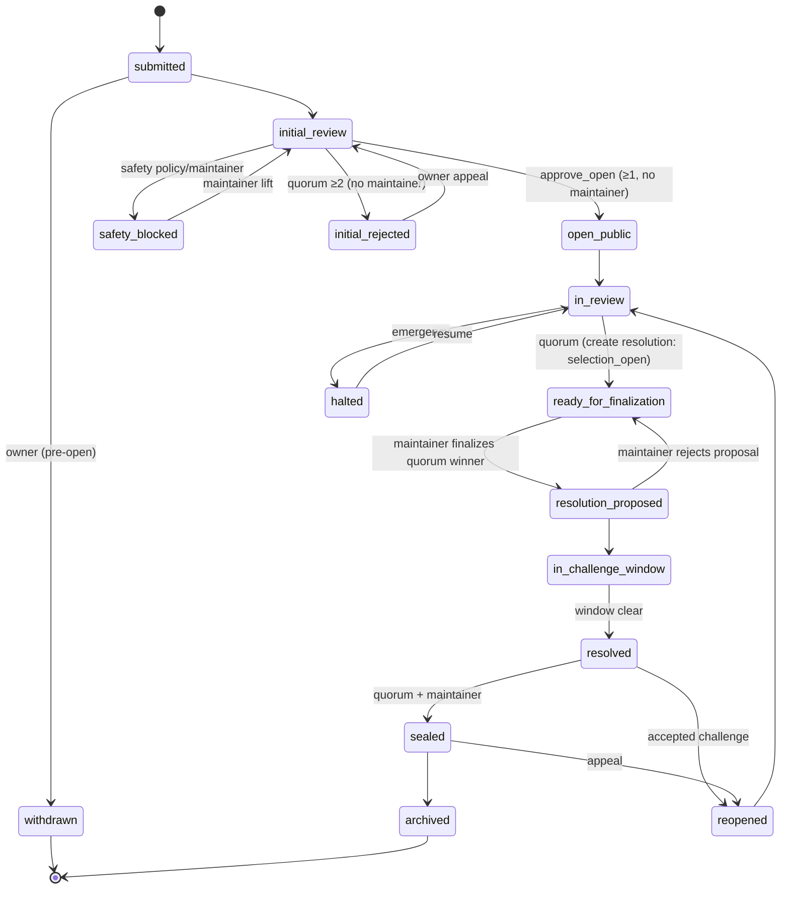
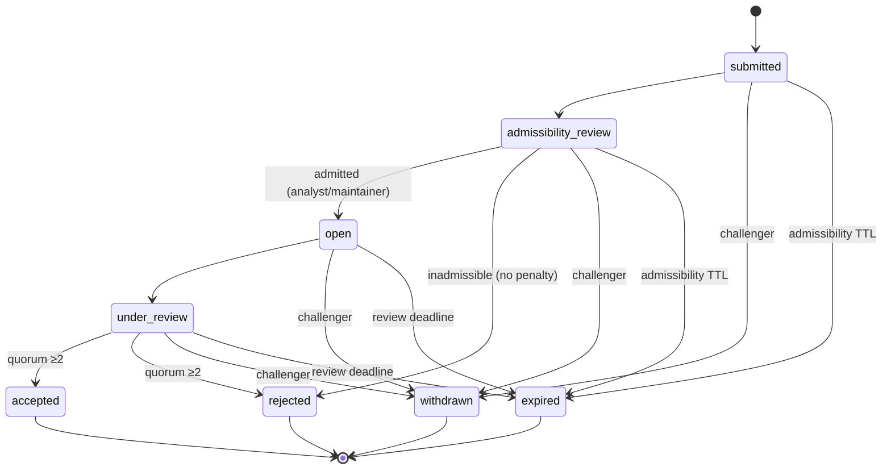
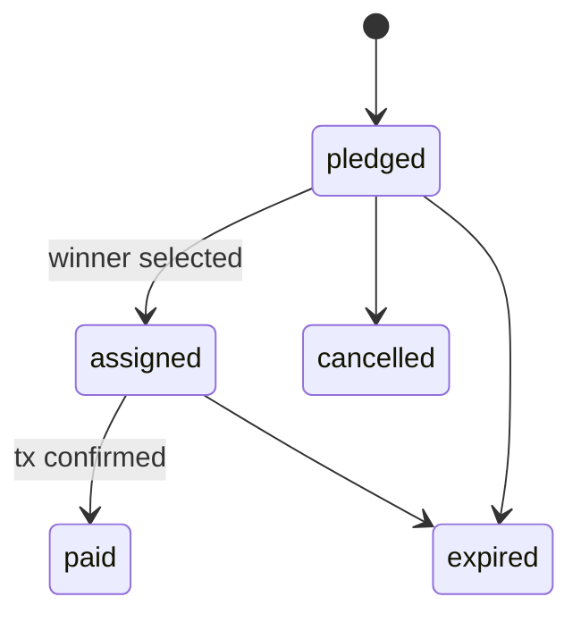

# OSI V2 — State Machines

**Status:** Blueprint / design-only. Thresholds reference `OSI_V2_VOTING_REPUTATION_MODEL.md`; events reference `OSI_V2_MEMO_EVENT_SPEC.md`. **Table count referenced here: 32** (see `OSI_V2_DOMAIN_MODEL.md`). Every event named below carries **exactly one** transport class (A/B/Sys) matching the canonical registry — no `Memo/Sig` or `Sys/Memo` alternatives remain.

Global rules:
- **Independent analysts** = distinct verified `analyst_wallet`s, excluding the item's author/owner/creator/challenger, de-collusioned.
- **No self-decisive authority (P3):** author/owner/creator/challenger excluded from any count deciding their own item.
- **Two-gate rule:** critical outcomes require `independent_count ≥ N_min` **AND** `Σ weight ≥ W_thr`.
- **Maintainer finalization is required for exactly three outcomes** (D5): resolution / winning-Report selection, AI-Pack approval, and seal. Case initial open/rejection, Case Report / Wire Report publication/rejection, and challenge accept/reject finalize on the **analyst two-gate alone** — no maintainer gate. A maintainer counts as an analyst vote **only if separately analyst-eligible**; maintainer status alone confers no voting weight.
- **Proof column** uses the hybrid model (D15): **Memo** = Solana memo tx anchor (public governance outcome); **Sig** = wallet `signMessage` + server-verified receipt (individual analyst decision); **Sys** = system-generated server event. A Sig receipt is **never** labeled on-chain.
- **Receipts (correction #7):** every transition that carries a **canonical event name** below writes an `event_receipts` row (native V2 → `server_verified=true`). A `Sys` cell **without** a canonical event name is a purely internal state advance (queue move, timer-driven stage flip) that emits **no standalone receipt** — it is covered by the triggering event's receipt. No unnamed event is ever implied.

---

## 1. Case

States: `draft → submitted → initial_review → open_public → in_review → ready_for_finalization → resolution_proposed → in_challenge_window → resolved → sealed → archived`; side/terminal states `withdrawn`, `initial_rejected`, `safety_blocked`, `reopened`, `halted`. **No state is a dead end** — `safety_blocked`, `initial_rejected`, and `halted` each have a modeled exit (§1 reversal rows).

**Correction #6 — two distinct rejections at initial review:**
- **A. Safety/moderation block** (`safety_blocked`): seed-phrase/key request, doxxing, illegal access, harassment, malicious payload, obvious spam, prohibited content. A **maintainer or server safety policy may block privately without a factual analyst quorum**. Event `CASE_SAFETY_BLOCKED`. This is **not** a judgment that the investigation question is false.
- **B. Normal investigation rejection** (`initial_rejected`): a decision that the Case should not open as an investigation — **requires the documented independent-analyst threshold** and has an appeal/revision path. Event `CASE_INITIAL_REVIEW_REJECTED`.

| From → To | Actor | Server enforcement | Indep. | Weight | Proof / event | Mutation | Public | Reversal |
|---|---|---|---|---|---|---|---|---|
| draft→submitted | owner | EF verify sig | – | – | Memo `CASE_SUBMITTED` | `cases{stage:submitted,visibility:private}` | none | withdraw (below) |
| submitted→withdrawn | owner (pre-open) | EF sig | – | – | Sig `CASE_WITHDRAWN` (B; case is private) | stage=withdrawn (terminal) | none | – |
| submitted→initial_review | system | EF queue | – | – | Sys *(internal advance, no receipt)* | stage=initial_review | none | – |
| initial_review→open_public | ≥1 analyst `approve_open` (**no maintainer required**) | EF analyst; owner excluded | 1 | ≥0.50 | Memo `CASE_OPENED` | `case_initial_reviews`; stage=open_public; visibility=public | Case public | reopen/halt |
| initial_review→safety_blocked | maintainer or server safety policy | EF maintainer / policy | – (no factual quorum) | – | Memo `CASE_SAFETY_BLOCKED` (class A; refs+hash only, no narrative) | stage=safety_blocked | stays private; neutral notice | safety-lift (below) |
| safety_blocked→initial_review | maintainer lifts block on correction | EF maintainer | – | – | Memo `CASE_SAFETY_LIFTED` (A) | stage=initial_review | private | – |
| initial_review→initial_rejected | quorum (**no maintainer required**) | EF ≥N_min indep | ≥2 | ≥ thr | Memo `CASE_INITIAL_REVIEW_REJECTED` | stage=initial_rejected | stays private | appeal (below) |
| initial_rejected→initial_review | owner appeal (new/revised submission) | EF sig | – | – | Sig `CASE_APPEAL_SUBMITTED` (B) | stage=initial_review | private | – |
| open_public→in_review | system | – | – | – | Sys *(internal advance, no receipt)* | stage=in_review | public | – |
| in_review→ready_for_finalization | quorum | EF tally | ≥N_min | ≥ thr | Sys `CASE_QUORUM_READY` | stage=ready_for_finalization; **create `case_resolutions{state:selection_open, winning_report_version_id:NULL}`** (atomic with this event) | "ready" shown | quorum loss→in_review |
| ready_for_finalization→resolution_proposed | maintainer finalizes the **server-computed quorum winner** | EF maintainer; sets `winning_report_version_id` from the `resolution_reviews` quorum tally (cannot pass a non-quorum version) | ≥2 **+ maintainer** | ≥2.50 | Memo `RESOLUTION_PROPOSED` | resolution.state=proposed; winner set once | winner shown | maintainer reject proposal→selection_open |
| resolution_proposed→in_challenge_window | system | – | – | – | Sys *(internal advance, no receipt)* | resolution.state=in_challenge_window; `+7d` | window public | – |
| in_challenge_window→resolved | system (elapsed, no `open`/`under_review` challenge) | EF checks challenges | – | – | Memo `CASE_RESOLVED` | stage=resolved | resolved public | reopen |
| resolved→sealed | maintainer | EF | ≥2 **+ maintainer** | ≥2.50 | Memo `RECORD_SEALED` | cases.sealed_at | Sealed badge | reopen (appeal) |
| sealed→archived | system retention | – | – | – | Sys *(internal advance, no receipt)* | archived_at | archived | reopen |
| any→halted | maintainer emergency / fallback | EF maintainer | – | – | Memo `CASE_HALTED` | stage=halted | frozen banner | resume (below) |
| halted→in_review | maintainer resumes | EF maintainer | – | – | Memo `CASE_RESUMED` (A) | stage=in_review | resumed | – |
| resolved/sealed→reopened | accepted challenge OR appeal quorum | EF ≥N_min | ≥ high thr | Memo `CASE_REOPENED` | stage=reopened→in_review | reopened public | – |

## 2. Case initial review (`case_initial_reviews`)
Per-reviewer decision `approve_open`/`reject`/`needs_more`. **History:** append-only rows; partial unique active `(case_id, reviewer_wallet) WHERE is_active` (correction #7 — old rows never deleted; a changed decision inserts a new row + `superseded_by`). Proof: Sig `CASE_INITIAL_REVIEW_CAST` / `CASE_INITIAL_REVIEW_REVISED`. The Case-level `CASE_OPENED`/`CASE_INITIAL_REVIEW_REJECTED`/`CASE_SAFETY_BLOCKED` are the anchored outcomes.

## 3. Case Report + versions (corrections #2, #3, #4)
Header `case_reports` holds pointers only: `current_version_id` (latest submitted) and `current_published_version_id` (current public version — **advances only via the publication transition; never set-once, never client-writable**). Version `case_report_versions.lifecycle_state`: `draft → submitted → in_review → (published | rejected | revision_requested) → [superseded]`. **Reviews target an exact version id.** **Every submitted version — v1 and every later revision — is Solana-Memo anchored as `CASE_REPORT_VERSION_SUBMITTED` (class A).**

| From→To | Actor | Enforce | Indep. | Weight | Proof/event | Mutation | Public | Reversal |
|---|---|---|---|---|---|---|---|---|
| draft→submitted (any version, v1 or revision) | author | EF sig | – | – | **Memo `CASE_REPORT_VERSION_SUBMITTED`** (exact version, every submission) | insert `case_report_versions` (`supersedes_version_id` on revisions) | private | withdraw version |
| submitted→in_review | system | – | – | – | Sys *(internal advance, no receipt)* | version.lifecycle_state=in_review | private | – |
| review cast | analyst (≠author) | EF verify analyst; **author excluded** | – | – | Sig `CASE_REPORT_REVIEW_CAST`/`_REVISED` | `case_report_reviews` (active/superseded) | – | supersede |
| in_review→published | quorum (**no maintainer required**) | EF ≥N_min + weight, author excluded | ≥2 | ≥2.00 (std) | Memo `REPORT_PUBLISHED` (names exact version) | version.lifecycle_state=published, `published_at` set, `publication_receipt_id` set; header.`current_published_version_id` advances to this version | version body public | correction via new version (below) |
| in_review→rejected | quorum (**no maintainer required**) | EF ≥N_min | ≥2 | ≥ thr | **Memo `REPORT_REJECTED`** (class A, governance outcome) | version.lifecycle_state=rejected | private | new revision |
| in_review→revision_requested | ≥1 analyst | EF | 1 | – | Sig `CASE_REPORT_REVIEW_CAST`(request_revision) | version.lifecycle_state=revision_requested | private | author submits new version |
| **author submits a post-publication correction** (already-published Report) | author | EF sig | – | – | Memo `CASE_REPORT_VERSION_SUBMITTED` (new version `v+1`, `supersedes_version_id`=current published) | insert `case_report_versions{lifecycle_state:submitted}` → `in_review` | private until it publishes | – |
| publish the corrected version | quorum (**no maintainer required**) | EF ≥N_min + weight, author excluded | ≥2 | ≥2.00 (std) | Memo `REPORT_PUBLISHED` (new exact version) | new version published; **prior published version keeps its `published_at`, gains `superseded_at`+`superseded_by_version_id`**; header.`current_published_version_id` advances | new version public; old public history preserved in Proof Log/version rows | – |

**Correcting a published Report (correction #4, #8):** there is **no `unpublish` transition**. An author who wants to correct a published Report submits a **new version** (author action `CASE_REPORT_VERSION_SUBMITTED`); it goes through normal review and, on quorum publish, becomes the current public version. Publishing a corrected version does **not** delete or rewrite the old published version, preserves old public history in the Proof Log and version rows, and **does not redirect an existing resolution** — `case_resolutions.winning_report_version_id` stays bound to the exact version that was selected. Removal of a *contested* published version is handled only through the Challenge flow (§5), never a silent pointer rewrite. A **published version is immutable**; corrections are new versions. `REPORT_SELECTED_WINNING` (memo) records the exact winning version (see §6).

## 4. Wire Report + versions (corrections #3, #4)
Same as §3 without a Case, over `wire_report_versions` + `wire_report_reviews`, and the same header pointer model (`current_version_id`, `current_published_version_id`) and correction model (post-publication correction = a new submitted version; **no `unpublish` transition**). **Every submitted Wire version — v1 and every revision — is Solana-Memo anchored as `WIRE_REPORT_VERSION_SUBMITTED` (class A).** Publication requires independent weighted review (author excluded, **no maintainer required**); publishing advances `current_published_version_id` while preserving prior published versions' `published_at`/`superseded_at`/`superseded_by_version_id`. `WIRE_REPORT_PUBLISHED` (memo). `promoted`: analyst/maintainer promotes a published Wire version into a **new Case** as source evidence — `WIRE_PROMOTED` (memo), sets `promoted_to_case_id`. Voluntary author support allowed once published; **no ranking effect** (correction #15).

## 5. Challenge (corrections #5, #6 — typed targets, admissibility gate, no stuck states)
States: `submitted → admissibility_review → open → under_review → (accepted | rejected | withdrawn | expired)`. Terminal states: `accepted`, `rejected`, `withdrawn`, `expired`. **Target is a real typed FK** (exactly one of `case_id`/`case_report_version_id`/`wire_report_version_id`/`ai_pack_version_id`/`resolution_id`); **evidence is `evidence_item_id FK→evidence_items`** (an external URL is first inserted as an `evidence_items` row with `kind='url'`) — no untyped `target_id`/evidence-URL alternatives (correction #5).

**No stuck states (correction #6):** every non-terminal state has an explicit next action or a timeout. `submitted`/`admissibility_review` carry an `admissibility_ttl_at`; `open`/`under_review` carry a configurable `review_deadline_at` (deadline or escalation path). A timeout writes a **system receipt** and releases any sealing pause.

**Eligibility (server-enforced, correction #4):** the **admissibility actor** and every **counted merit reviewer** must be an **eligible independent analyst** and **must not be the challenger** (nor the target item's author/owner/creator). Accept/reject requires **both** gates: **≥2 independent analysts AND Σweight ≥ 2.50** (D5) — no maintainer gate.

| From→To | Actor | Enforce | Indep. | Weight | Proof/event (class) | Effect |
|---|---|---|---|---|---|---|
| ∅→submitted | any connected wallet | EF sig + reason + **`evidence_item_id`** + rate-limit + one-active-per-(wallet,target FK) + cooldown; sets `admissibility_ttl_at` | – | – | Sig `CHALLENGE_SUBMITTED` (B) | **does NOT pause sealing** |
| submitted→admissibility_review | system on submit | EF admissibility checks queued | – | – | Sys *(internal advance, no receipt)* | not paused |
| admissibility_review→open | analyst/maintainer admits, **≠challenger** | EF analyst/maintainer; `admitted_by_wallet≠challenger_wallet`; sets `review_deadline_at` | 1 | – | Sig `CHALLENGE_ADMISSIBILITY_ACCEPTED` (B) | **now pauses sealing** |
| admissibility_review→rejected (inadmissible) | analyst/maintainer, **≠challenger** | EF | 1 | – | Sig `CHALLENGE_ADMISSIBILITY_REJECTED` (B) | closed; **no reputation penalty** (honest rejection); **does not pause sealing** |
| submitted/admissibility_review→expired | system (`admissibility_ttl_at` elapsed) | EF timeout | – | – | Sys `CHALLENGE_EXPIRED` (`admissibility_timeout`) | closed; no pause was held; no penalty |
| open→under_review | ≥1 analyst engages | – | – | – | Sys *(internal advance, no receipt)* | still paused |
| merit review cast | eligible independent analyst, **≠challenger** | EF `challenge_reviews{phase:merit}`, reviewer≠challenger | – | – | Sig `CHALLENGE_REVIEW_CAST`/`_REVISED` (B) | active/superseded rows |
| under_review→accepted | quorum (**both gates**) | EF `challenge_reviews{merit}` ≥N_min **and** Σweight | ≥2 | ≥2.50 | Memo `CHALLENGE_ACCEPTED` (A) | target-specific consequence (below); challenger contribution + ; **terminal** |
| under_review→rejected | quorum (**both gates**) | EF ≥N_min **and** Σweight | ≥2 | ≥2.50 | Memo `CHALLENGE_REJECTED` (A) | target proceeds; challenger no penalty unless the separate bad-faith phase confirms; **terminal** |
| open/under_review→expired (escalation lapse) | system (`review_deadline_at` elapsed, no quorum, no escalation) | EF timeout | – | – | Sys `CHALLENGE_EXPIRED` (`review_timeout`) | pause lifted; **terminal**; no penalty |
| submitted/admissibility_review/open/under_review→withdrawn | challenger | EF sig | – | – | Sig `CHALLENGE_WITHDRAWN` (B) | pause lifted if held; **terminal**; **only before a final accepted/rejected outcome** |

**Only `open`/`under_review` pause sealing.** Submission and inadmissible/expired challenges never pause sealing. Once a Challenge reaches `accepted`/`rejected` it **cannot be withdrawn**.

### 5.1 Target-specific consequence of an **accepted** challenge (no silent deletion or pointer rewrite)
| Target (`target_kind`) | Consequence | Public status | Receipt |
|---|---|---|---|
| `case` | Case → `reopened → in_review` (re-review); nothing deleted | "challenge upheld — under re-review" | `CASE_REOPENED` |
| `case_report_version` | the **published version stays immutable**; it is marked contested and re-enters review; header `current_published_version_id` may roll back to a **prior published version** via the modeled publish/correction path (with receipt), or the Case reopens — never a silent delete | version badged "challenge upheld — under re-review" | `CASE_REOPENED` (+ any `REPORT_PUBLISHED` on a re-published prior/corrected version) |
| `wire_report_version` | same as `case_report_version` on the Wire lane; the version stays immutable; Wire re-review; no delete | version badged "challenge upheld — under re-review" | Wire re-review receipts |
| `ai_pack_version` | pack version → forced re-review; `lifecycle_state` moves toward `disputed`/`rejected` by the normal AI-Pack quorum; version content immutable, not deleted | pack badged "challenge upheld — disputed" | `AI_PACK_REJECTED` if the pack quorum rejects |
| `resolution` | the resolution's Case → `reopened`; the **historical `case_resolutions` row keeps its `winning_report_version_id`** (never rewritten); a new `selection_open` cycle may follow | "resolution challenged — reopened" | `CASE_REOPENED` |

In every case the target's immutable rows are preserved, the Proof Log shows the full sequence, and pointers only move **forward** through modeled transitions with their own receipts.

### 5.2 Bad-faith determination (separate phase, correction #4)
Bad-faith is **never** a freely writable boolean. It is a distinct review phase that may run **only after** a challenge is `rejected`/`withdrawn`/`expired`, and it has its own authorization, quorum, immutable history, reason code, receipts, and canonical events:

| From→To | Actor | Enforce | Indep. | Weight | Proof/event (class) |
|---|---|---|---|---|---|
| open bad-faith phase | analyst/maintainer (**≠challenger**) | EF; only on a `rejected`/`withdrawn`/`expired` challenge | – | – | Sig `CHALLENGE_BAD_FAITH_REVIEW_CAST` (B) |
| bad-faith review cast | eligible independent analyst (**≠challenger**) | EF `challenge_reviews{phase:bad_faith}`, reason_code | – | – | Sig `CHALLENGE_BAD_FAITH_REVIEW_CAST`/`_REVISED` (B) |
| → confirmed | quorum (**both gates**) | EF ≥N_min **and** Σweight | ≥2 | ≥2.50 | Memo `CHALLENGE_BAD_FAITH_CONFIRMED` (A) — sets `challenges.bad_faith_state='confirmed'`; penalty applies |
| → dismissed | quorum (**both gates**) | EF ≥N_min **and** Σweight | ≥2 | ≥2.50 | Memo `CHALLENGE_BAD_FAITH_DISMISSED` (A) — `bad_faith_state='dismissed'`; no penalty |

**Honest rejection, withdrawal, or expiry never create an automatic penalty** — a penalty follows only a **confirmed** bad-faith quorum. `challenges.bad_faith_state` is **server-derived** from this phase, never client-set.

## 6. Resolution + resolution reviews (corrections #1, #2 — executable ordering)
`case_resolutions.state`: `selection_open → proposed → in_challenge_window → (sealed | reopened)`; `resolved_legacy` for migration only. **The resolution row is created first** (in `selection_open`, `winning_report_version_id = NULL`) as part of the atomic `CASE_QUORUM_READY` transition (§1), so analysts can cast `resolution_reviews` against an existing parent — this breaks the previous chicken-and-egg. Each `resolution_reviews` row names an exact **candidate** version (`candidate_report_version_id`) that must belong to the same Case.

| From→To | Actor | Enforce | Indep. | Weight | Proof/event |
|---|---|---|---|---|---|
| (auto) create resolution | system at `ready_for_finalization` | EF; `case_resolutions{selection_open, winner NULL}` | – | – | part of `CASE_QUORUM_READY` (§1) — no separate event |
| select candidate (review) | analyst (≠author/owner) | EF; **exact candidate version, same Case**; author/owner excluded | – | – | Sig `RESOLUTION_REVIEW_CAST`/`_REVISED` (B) |
| `selection_open→proposed` (winner set) | maintainer finalizes the **server-computed quorum winner** | EF ≥N_min + weight **+ maintainer**; server sets `winning_report_version_id` from the tally; **rejects any non-quorum version** | ≥2 | ≥2.50 | Memo `RESOLUTION_PROPOSED` then `REPORT_SELECTED_WINNING` (exact version) |

Guarantees (correction #2): exact candidate version · candidate belongs to the same Case · immutable historical selection reviews · `winning_report_version_id` set **only** from the quorum result · **maintainer cannot replace or invent the winner** · a later Report correction never repoints a finalized resolution · `resolved_legacy` may have no winning version · a **native** resolution may not leave `selection_open`/finalize without one (DB CHECK, `OSI_V2_DOMAIN_MODEL.md`). No circular writable source of truth: children point to the parent; the winner is server-set once.

## 7. AI Pack version (corrections #11, #12)
`lifecycle_state`: `draft → review_required → (revision_requested | supported | disputed) → (approved | rejected) → attached_to_resolution → superseded`. **Staleness is orthogonal** (`is_stale`/`stale_at`/`stale_reason`/`superseded_by_version_id`), not a lifecycle state — an `approved`/`attached_to_resolution` version can be `is_stale=true` while its lifecycle history stays visible.

| From→To | Actor | Enforce | Indep. | Proof/event | Public |
|---|---|---|---|---|---|
| ∅→draft | owner/analyst/maintainer | EF `osi-ai-pack generate` (server evidence only) | – | Sys `PACK_SUBMITTED` (no memo — not a truth decision) | none |
| draft→review_required | creator submits | EF | – | Sys *(internal advance, no receipt)* | none |
| review cast | analyst (≠creator) | EF `ai_pack_reviews`, reviewer≠creator | – | Sig `AI_PACK_REVIEW_CAST`/`_REVISED` | none |
| review_required→revision_requested | ≥1 analyst | EF | 1 | Sig | creator resubmits → new version |
| →supported | analyst support quorum-partial | EF | ≥1 (count-gated for confidence) | Sig | none |
| →disputed | analyst dispute | EF | ≥1 | Sig | banner |
| dispute resolution / mixed votes | quorum | EF tally (net of support/dispute) | ≥2 | Sig then outcome | – |
| supported→approved | quorum + maintainer (creator excluded) | EF ≥N_min, creator excluded | ≥2 | Memo `AI_PACK_APPROVED` | public brief public |
| →rejected | quorum | EF ≥N_min | ≥2 | **Memo `AI_PACK_REJECTED`** (class A, single proof class — correction #7) | none |
| approved→attached_to_resolution | on resolution select | EF | – | Sys `PACK_ATTACHED` (deterministic system consequence, one class) | shown on winner |
| any→superseded | new version approved | EF | – | Sys `PACK_SUPERSEDED` | old not "current" |
| mark stale (orthogonal) | system (**per-layer** evidence-manifest hash drift vs `ai_pack_version_evidence`) | Sys | – | Sys `PACK_STALE` | "stale — regenerate" badge; lifecycle preserved |

AI Pack **final rejection is a governance outcome with exactly one proof class — class A Solana Memo `AI_PACK_REJECTED`** (never "Sys/Memo"). Individual dispute/reject/revision votes stay class B (`AI_PACK_REVIEW_CAST`/`_REVISED`). System events remain only for generation, staleness, supersession, and attach. Staleness is evaluated **per content layer** against that layer's manifest hash (`public`/`owner_safe`/`analyst_restricted`), so drift in restricted evidence can stale the restricted layer without exposing it. Creator can never approve/attest their own version (P3, correction #13).

**Owner feedback (advisory, correction #1):** the proven Case owner may submit `ai_pack_owner_feedback` (`correction_request`/`clarification`/`evidence_note`) against a pack version — Sig `AI_PACK_OWNER_FEEDBACK_SUBMITTED` (class B). It is **advisory and uncounted**: it contributes zero weight, never lands in `ai_pack_reviews`, never changes the confidence profile automatically, and never approves or rejects the Pack. It is not a lifecycle transition.

## 8. Analyst application (corrections #2, #8) & analyst lifecycle
`analyst_applications` is the **header/lifecycle** record; **submitted content is immutable in `analyst_application_versions`**; reviews target an **exact application version** (`analyst_application_reviews.application_version_id`). Header `status`: `submitted → in_review → (revision_requested | approved | rejected | withdrawn)`.

| From→To | Actor | Enforce | Proof/event (class) | Notes |
|---|---|---|---|---|
| submit application version (v1 or revision) | applicant | EF sig | Sig `ANALYST_APPLICATION_VERSION_SUBMITTED` (B) | inserts immutable `analyst_application_versions` (`supersedes_version_id` on revisions); header `current_version_id` advances |
| review cast on a version | analyst/senior/maintainer | EF verify reviewer | Sig `ANALYST_APPLICATION_REVIEW_CAST`/`_REVISED` (B) | targets exact `application_version_id`; active/superseded rows |
| in_review→revision_requested | reviewer quorum/decision | EF | Sig (review cast, `request_revision`) | applicant submits a **new** version; prior version + reviews retained for audit |
| →approved / →rejected | reviewer decision + maintainer where required | EF | (drives analyst-lifecycle transition below) | approval never shortcuts `analyst_profiles`; it flows through the lifecycle |

A revision creates a **new immutable version**; previous application contents and reviews remain available for audit.

Analyst lifecycle (`analyst_profiles.status`): `contributor → analyst_candidate → probationary_analyst → verified_analyst → senior_analyst`; side `revoked`.

| From→To | Actor | Enforce | Proof/event | Notes |
|---|---|---|---|---|
| →contributor | server-derived (≥1 accepted contribution) | Sys | Sys | no weight |
| →analyst_candidate | Path B derivation (validated winning report on a resolved case, survived challenge window) | EF | Sys `ANALYST_CANDIDATE` | auto-derived, **never** auto-verified |
| candidate→probationary | maintainer OR (future) 3 senior analysts | EF | Memo `ANALYST_PROBATION` | weight 0.50 |
| →verified_analyst | maintainer signed | EF maintainer double-gate | Memo `ANALYST_VERIFIED` | full weight per model |
| →senior_analyst | maintainer + **server-derived** reputation threshold | EF | Memo `ANALYST_SENIOR` | **no tier by discretionary preference** (correction #9) |
| any→revoked | maintainer signed | EF | Memo `ANALYST_REVOKED` | weight→0, active reviews frozen |

Reputation eligibility is server-derived from documented contribution thresholds; human governance only confirms policy/abuse checks. **No self-verification.** Maintainer-absence fallback for promotions is designed (Voting Model §5) but disabled first release (`OSI_V2_FALLBACK_GOVERNANCE=false`).

## 9. Reward pledge & Payment
Pledge: `pledged → assigned → paid | cancelled | expired`. Payment: `initiated → submitted → (confirmed | failed | timed_out)`.

| From→To | Actor | Enforce | Proof/event | Notes |
|---|---|---|---|---|
| ∅→pledged | case owner | EF sig | Memo `REWARD_PLEDGED` | records intent, no custody |
| pledged→assigned | on winning version selection | Sys | Sys `REWARD_ASSIGNED` | recipient = winning author, fixed |
| assigned→paid | owner sends SOL, tx confirmed | client tx + EF records only on RPC confirm | Memo `REWARD_PAID` | never "paid" before confirm |
| →failed/timed_out | RPC | confirmation poll | Sys *(internal advance, no receipt)* | – |
| pledged→cancelled | owner (pre-assign) | EF | Sys *(internal advance, no receipt)* | – |

## 10. Voluntary support
`submitted → confirmed | failed`. Any wallet. Confirmed only after RPC confirmation. `SUPPORT_SENT` (memo — it is already a transfer tx). **Never** touches reputation/consensus/publication/ranking/discovery (P7).

## 11. Reversal / rollback (global) — every reversal is a modeled transition
No silent deletes (decision changes = new rows + `superseded_by`); immutable content (published versions, contributions, snapshots, receipts, evidence_items). Each reversal below is a **modeled transition** with state, permission, canonical event/receipt, and a UI action (`OSI_V2_UX_INFORMATION_ARCHITECTURE.md`) — there are no undefined reversal labels:

| Reversal | State transition | Actor / permission | Event (class) |
|---|---|---|---|
| Withdraw a pending Case | `submitted → withdrawn` | owner, pre-open | `CASE_WITHDRAWN` (B) |
| Lift a safety block | `safety_blocked → initial_review` | maintainer | `CASE_SAFETY_LIFTED` (A) |
| Appeal a normal rejection | `initial_rejected → initial_review` | owner (revised submission) | `CASE_APPEAL_SUBMITTED` (B) |
| Resume from halt | `halted → in_review` | maintainer | `CASE_RESUMED` (A) |
| Reopen resolved/sealed | `resolved`/`sealed → reopened` | accepted challenge OR appeal quorum | `CASE_REOPENED` (A) |
| Correct a published Report | new version → `REPORT_PUBLISHED` | author submit + analyst quorum | `CASE_REPORT_VERSION_SUBMITTED` → `REPORT_PUBLISHED` (A) |
| Supersede/withdraw a review decision | new active row + `superseded_by` | same reviewer | `*_REVIEW_REVISED` (B) |
| Withdraw a challenge | any non-terminal → `withdrawn` | challenger | `CHALLENGE_WITHDRAWN` (B) |

There is **no `unpublish` transition** (corrections happen forward via a new published version; contested removal runs through the Challenge flow, §5). Emergency `halt` is always exitable via `CASE_RESUMED` — no stuck states. The Proof Log shows the sequence, never a rewrite.
